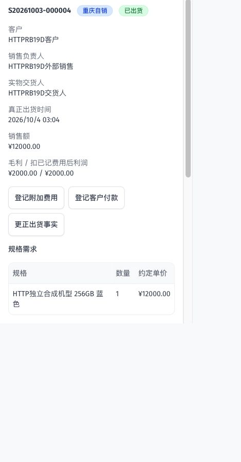
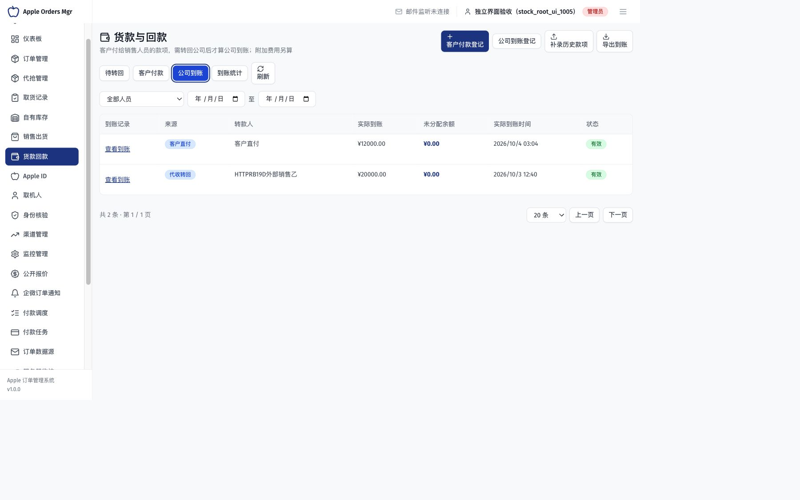
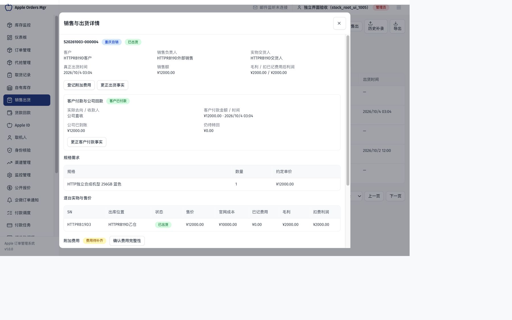
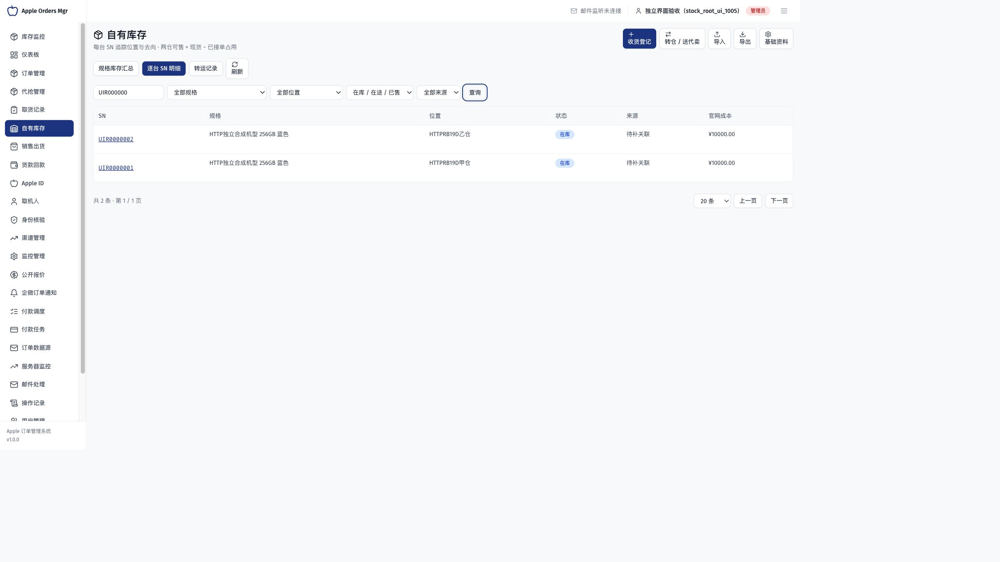

# 自有库存与销售独立验收报告

> 状态：历史归档；本地技术验收通过，真实业务及生产验收另列
>
> 最近核对：2026-10-04（北京时间）
>
> 基线：`origin/main@42bae455c001217afc2c1c53ce504b91665955e3`；分支 `codex/stock-sales-management` 的本地未提交实现
>
> 适用范围：SN 库存、重庆双仓销售、明威代卖、费用与毛利、代收回款、历史导入、权限、旧取货兼容及 PC/H5
>
> 验证范围：主 Agent 独立编写并执行本地合成验收；真实 PostgreSQL、HTTP 和浏览器。没有发布生产或使用真实业务数据。

## 交付位置与复核入口

代码和完整方案位于 `/Users/seraph/.codex/worktrees/stock-sales-management/AppleOrderMgr`。原工作区 `/Users/seraph/GitHouse/AppleOrderMgr` 的其他未提交工作保留；本次业务代码在独立工作树实现。

- [编码实施方案](../../planning/自有库存与销售管理编码实施方案.md)
- [数据契约](../../database/自有库存与销售数据契约.md)与 [28 项验收要求](../../testing/自有库存与销售管理验收清单.md)
- [开发者验证记录](2026-10-04-自有库存与销售开发验证记录.md)，与本报告分别记录，不互相代签
- [独立验收结果及原始结果摘要](自有库存独立验收证据/独立验收结果.json)

本地预览为 `http://127.0.0.1:5319/stock`，对应独立 API `127.0.0.1:3309` 和数据库 `apple_order_mgr_stock_test_1005`。浏览器已有合成管理员会话。登录凭据只保存在忽略目录的本机文件中，不进入报告和提交。该预览中的手机、人员、价格和款项全部是合成数据。

## 主 Agent 独立执行结果

共 54 个独立 API/数据库场景通过，另外执行了真实页面流程和 XLSX 文件读回。多数场景包含多项断言，数量不与开发者 Jest 测试相加。

| 分组                   | 数量 | 实际执行与结果                                                                                                                                               |
| ---------------------- | ---: | ------------------------------------------------------------------------------------------------------------------------------------------------------------ |
| Migration 和数据库约束 |   15 | 正式空库 up/down/up；旧订单、取货 UUID/SN/时间保持；21 个新表；NULL/NaN、重复 SN、缺位置约束拒绝；带新业务数据 down 拒绝且数据保留                           |
| 库存、销售及资金服务   |   12 | 真实事务与两个并发接单；跨仓挑货与整笔出货；共用 1 元分为 0.34/0.33/0.33；20 元单台费用；代收全款、分次转回、公司直收、明威分次售出和历史补录                |
| 认证 HTTP 主流程       |   12 | 未登录拒绝、同键重放、改载荷/改目标冲突、并发占用、费用毛利、部分回款、字段权限、非法日历日期、纠错令牌和停用后历史仍可读                                    |
| 扩展 HTTP 反例与批量   |    7 | 实际 UI 保存后接口读回；普通收货员不能覆写已确认成本依据；代收人和到账付款人联动更正；跨用户及旧令牌拒绝；100 台收货；500 行原子导入；错误行及预览后变化拒绝 |
| 连接中断与锁恢复       |    3 | 事务写入实物/事件后主动终止该 PostgreSQL 会话，完整回滚并返回 503 `STOCK_CONNECTION_LOST`；真实锁等待超时返回 `STOCK_BUSY`；原请求键可安全恢复且只写一笔     |
| 真正数据库死锁         |    1 | 两个连接反序锁定合成商品行产生死锁；业务写入全部回滚，返回可重试错误，原请求重试及再次重放只有一台实物                                                       |
| 最终 HTTP 复核         |    4 | 新销售编号为北京时间日期；销售/到账分别按业务日期统计；页面导入两仓记录读回；外部参数不能冒用内部导出分页开关                                                |

独立数据库为 `apple_order_mgr_stock_test_1006`。故障注入仅针对本测试创建的连接和行；没有中断共享数据库服务。开发者另行执行了真实 Node 子进程在提交前被 `SIGKILL` 的测试，其证据见开发记录。

一组明确的金额读回：三台售价合计 33,000 元、官网成本合计 30,000 元，毛利 3,000 元；共用 1 元费用加单台 20 元费用后为 2,979 元。外部销售应转回货款仍为 33,000 元，转回 20,000 元后待转回 13,000 元。费用不抵扣应转回货款，到账不重复计销售收入。

批量实测仅代表本机本轮样本：100 台收货约 217 ms，20 行分页约 10 ms；500 行预览约 49 ms，原子提交约 809 ms。不可据此推断生产峰值或长期性能。

## 浏览器与文件核验

使用当前前后端和真实本地 API，没有把模拟 API 的成功提示当作落库证据。

1. 电脑创建销售单并按规格占用数量，375 像素界面按 SN 挑货；重复输入同一 SN 未增加数量。375×400 的短视口可以完成交货人选择、逐台售价填写及整单出货。刷新后单号 `S20261003-000004` 仍为已出货，售价 12,000 元、成本 10,000 元、毛利 2,000 元。
2. 同一单在页面登记公司直收，真实 API 查到唯一一笔 12,000 元公司到账；销售详情显示客户已付款、公司已到账、待转回 0，并移除重复登记入口。
3. 通过文件选择器上传实际 `.xlsx`，预览两行、确认整批导入后刷新，按 `UIR0000001` / `UIR0000002` 查到两个不同仓库及各 10,000 元成本。来源订单待补不影响入库。
4. 实际 DOM 视口为 1366×767、1440×900、1920×1080、375×400 和 375×720。已核对对应库存/回款/出货界面和页面宽度；表格保留容器内滚动；未把浏览器短视口等同于真实触屏设备。
5. 模板、普通仓管导出和管理员成本导出均实际 HTTP 下载并用 XLSX 解析读回：模板只有表头，普通导出无成本/利润列，管理员成本为数值单元格；普通仓管显式要求成本列返回 403。

IAB 的模板按钮点击未显示应用错误，但该工具未观察到下载事件，因此不把浏览器下载落盘判为已验证；HTTP 文件下载、内容及权限已验证。真实手机软键盘、包装盒相机和现场设备性能仍需实际设备确认。

## 返工闭环

主 Agent 在实现和验收中提出以下问题，由实现子 Agent 修改，再独立复核：

| 问题                                      | 修改与复核                                                                                     |
| ----------------------------------------- | ---------------------------------------------------------------------------------------------- |
| 无来源订单的全国直发缺登记入口            | 新增仅登记实物身份的入口；不虚构重庆入库；服务及 HTTP 已通过                                   |
| SQL CHECK 可被 NULL/NaN 绕过              | 显式非空及有效金额检查；真实 PostgreSQL 拒绝断言通过                                           |
| Migration down 检查与写入存在竞争窗口     | 使用同一事务锁后再判断业务数据；带数据拒绝回退并保留全部表                                     |
| 普通收货可改写已确认成本所依赖的规格/日期 | 重复登记、收货与历史导入保护；实际普通用户 HTTP 绕过请求拒绝，合法收货保留原成本               |
| 不存在的日历日期被自动归一化              | `2026-02-30` 明确拒绝；HTTP 通过                                                               |
| 同时改代收人与既有转款人会受中间状态阻碍  | 同事务更新事实、重建资金关联、最终校验；实际 20,000 元分配与 13,000 元余额保持                 |
| 批量每台重复读取全表                      | 批量共享投影、列表数据库分页、聚合查询；100 台与 500 行实测通过                                |
| 客户付款成功后页面仍提示登记              | 显示付款去向、时间、到账和待转回，保留纠错；实际页面复测通过                                   |
| 单号按 UTC 日期显示                       | 新单号按北京时间生成；最终回归确认，不修改已有单号                                             |
| 意外断连被错误描述为字段无效              | 断连与锁冲突分别返回 503；真实连接终止后复测通过                                               |
| 外部 query 可伪装内部导出扩至 5000 行     | 内部开关严格要求布尔值，HTTP 字符串/对象不可扩大分页；实际外部请求均返回 400，合法导出保持可用 |

测试本身的两处输入问题（筛选字段误用单数、合成 SN 长度不合法）已修正并重跑，没有作为产品缺陷或通过证据隐藏。

## 最终门禁与验证边界

STOCK-01 至 STOCK-07 的本地实现、独立验收、返工复测及交付文档已完成，本地技术验收通过。主 Agent 已逐项核对开发者冻结清单，104 个实现文件 SHA256 全部一致；此后仅补充本报告及交付状态，不再修改业务代码。代码文件摘要与测试摘要一并保存在上方独立验收结果中。

| 最终门禁          | 已核对结果                                                                                                         |
| ----------------- | ------------------------------------------------------------------------------------------------------------------ |
| 主 Agent 独立验收 | 54 个真实 HTTP／PostgreSQL 场景通过；页面操作、XLSX 下载及导入读回另列                                             |
| 库存专项开发测试  | 9 套／112 项通过，其中 26 项真实 PostgreSQL；模块行覆盖率 82.28%，语句 79.24%，分支 66.56%                         |
| 默认全量后端回归  | 89 套／999 项通过；29 套／389 项受外部或数据库门禁限制未执行，不计为通过                                           |
| 前端开发验证      | 6 组／28 项通过，0 页面错误；其中 8 项设备异常与重试使用明确的浏览器合成条件，真实硬件未替代                       |
| 代码质量          | 后端 lint 0 错误／3840 警告，含存量及新增提示；前端 0 错误／24 条非 stock 文件警告。定向 Prettier 和 Vite 构建通过 |
| 文档与差异        | 最终状态更新后再次执行文档检查，191／191 可达、87 个模型字段覆盖；`git diff --check` 通过                          |

上述测试数量分属不同验证层次，可能覆盖同一业务，不能相加为独立功能数。已有 lint 警告保留，没有将其描述为零警告。开发者的非默认日期输入已在实际 Chrome 中提交并由 HTTP 精确查回到秒；相机轨道释放、迟到结果和 OCR 取消属于合成验证。

供次日验收的本地预览及合成数据保留。实际启用前仍需配置真实仓库、人员权限、官网价格版本和启用盘点时点，再用真实照片、现场库存及结算资料核对。当前新模块默认关闭，只有本轮隔离验收环境已启用。

真实包装盒扫码、照片 OCR、OSS 外部对象存储、真实账户收付款、仓库盘点及生产迁移尚未执行。上述环节需要真实设备、配置与业务样本；本报告的本地合成验收不能替代它们。本次没有提交、推送或部署生产，真实退货/换货也不属于首期范围。
