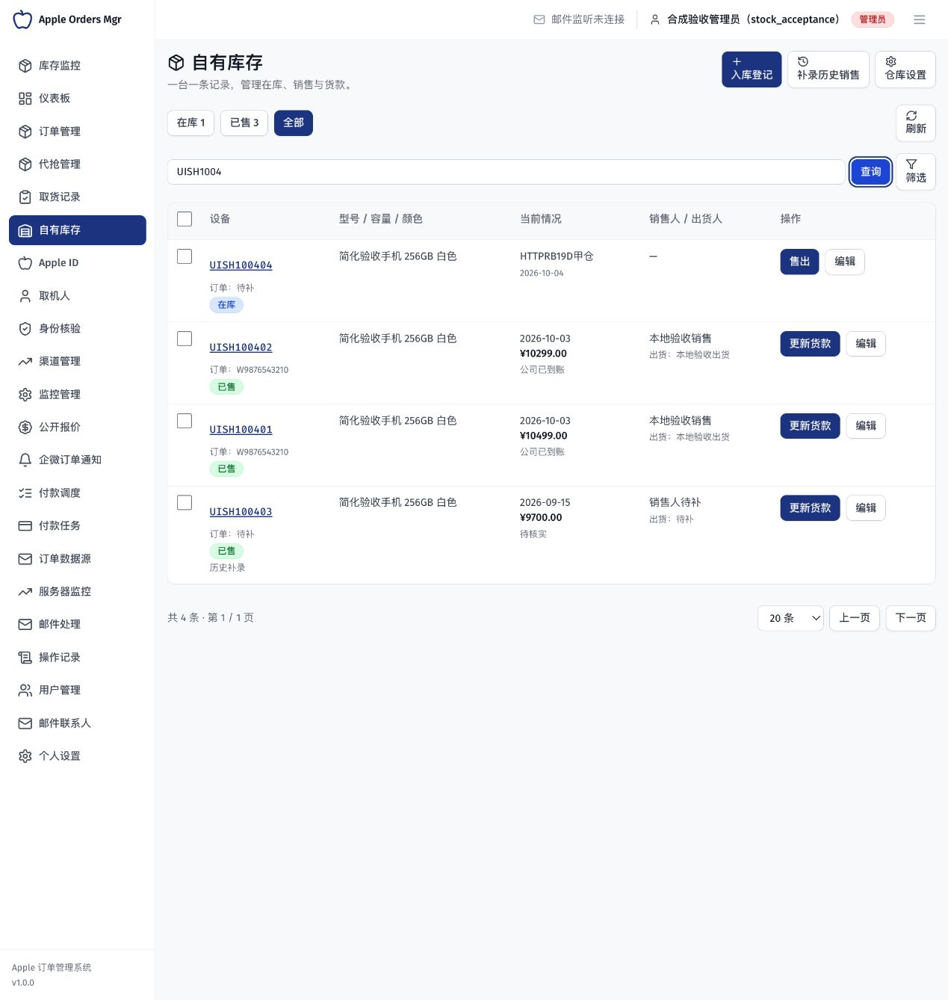

# 自有库存简化版独立验收报告

> 状态：历史归档；简化版本地独立技术验收通过，已授权主分支集成及生产发布
>
> 最近核对：2026-10-04
>
> 范围：已批准的单台 SN 台账、直接售出、货款更新、历史补录及旧复杂入口退出
>
> 基线：独立工作树 `codex/stock-sales-management`，基于 `origin/main@42bae455` 的本轮未提交实现
>
> 验证边界：使用本地合成记录执行真实 HTTP、PostgreSQL 和浏览器操作；未提交、推送或部署生产，不代表真实业务验收

## 交付结果

[已批准方案](../../planning/自有库存简化版方案.md)已经落实为一张“自有库存”台账。日常操作只需入库、选一台或多台登记售出、更新货款，以及直接补录历史销售。型号、容量、颜色和人员在当前表单录入；订单号、成本、费用和历史未知资料允许后补。销售人、出货人分开记录，没有收货人或客户建档前置。

旧“销售出货”“货款回款”菜单及页面退出，原链接进入统一台账。共删除 2 个旧页面和 17 个专用前端组件；共用 SN 身份、权限、扫码、照片、事务及已有事实仍复用。旧复杂写接口返回 `410 STOCK_FLOW_RETIRED`，保留取消旧草稿占用的必要出口；旧记录只读和必要兼容能力保留，不运行两套日常流程。

本轮没有删除旧数据表。第二份正式 Migration 增量演进，首份库存 Migration 的 SHA256 与简化前完全一致。在两个原验收数据库分别核对 23 张表，迁移前后行数及全部既有字段摘要一致。

## 独立执行结果

下列检查由主 Agent 独立执行，不以开发者自测或旧完整版通过数量替代本轮结果。[结构化证据](自有库存简化验收证据/独立验收结果.json)包含逐项名称、请求状态、迁移保全摘要及界面保存后的实际读回值，不保存登录凭据。

| 分组                  |         数量 | 结果与主要证据                                                                                                                                             |
| --------------------- | -----------: | ---------------------------------------------------------------------------------------------------------------------------------------------------------- |
| 核心 HTTP             |           19 | 未登录拒绝、单台身份、未知订单号、成本待补、两仓直接批量售出、原子回滚、幂等重放、并发只售一次、逐台费用和利润、跨日代收转回、误录更正、权限及非法日期金额 |
| 订单桥接与权限 HTTP   |            5 | 原取货 SN 的空白订单号不解除已知绑定；已售后补订单保持原销售；订单 TAG 边界；无资金权限仍能登记未收款；旧资金状态及筛选一致                                |
| 界面读回与旧入口 HTTP |            5 | 电脑和手机真实提交的四台记录持久化；日期、仓库、人员、金额、历史未知字段一致；11 个旧写入口均为 410，调用前后台账完全一致                                  |
| 最终变更定向 HTTP     |            4 | 旧无收款事实保持待核实；批内重复 SN 整批拒绝且没有失效详情链接；历史误售恢复必须补真实入库日期；无资金权限者仍能看到兼容限制且不泄漏敏感字段               |
| 来源解绑安全 HTTP     |            3 | 旧冗余订单文本、新台账关联和旧扫码绑定均核对 TAG；解绑后不泄漏原订单号，库存、身份及销售资金保持                                                           |
| 增量 Migration 与约束 |            4 | 无新增业务时 down/up 可逆；拒绝 NaN、无穷和负费用；历史待核实约束；已有新业务值时拒绝破坏性 down                                                           |
| 旧数据迁移保全        | 2 库 × 23 表 | 库存 21 表加订单、取货表，行数和旧字段摘要全部保持；有数据的表实际参与摘要校验，空表明确记录为零                                                           |

合计 **36 组 HTTP 与 4 组迁移约束通过**；迁移保全、浏览器实操另列，不重复计数。

## 电脑与手机实际操作

主 Agent 在本地验收页面执行以下连续操作，并通过刷新及真实 API 读回确认保存结果：

1. 电脑表单就地新增手机规格，一次录入两个 SN，共用一个尚未导入系统的订单号；保留不同单台费用，入库日期填真实的较早日期。
2. 将其中一台改到另一仓库，保留原 SN 身份及修改记录。
3. 在 **375 × 400** 的短视口中选中跨仓两台，一次录入不同售价、销售人和出货人，按真实销售日保存为代收待转回。
4. 批量更新为次日公司到账，刷新后原销售日期、原代收人和收款日期保持，没有因到账再计一次销售。
5. 手机直接补录历史已售，未知的成本、仓库、入库日、人员和货款保留待补或待核实，现货数量不变。
6. 手机入库尝试已有 SN，能打开原记录而不重复建档；改成新 SN 后正常完成入库。短视口可滚动到提交按钮，页面没有横向溢出。
7. 检查旧页面跳转、统一导航和历史误售恢复表单。缺原入库日时，恢复日期默认留空且必填，不能自动编造为今天。检查后关闭表单，没有改动展示用历史记录。

演示的四台均为合成资料：

| SN         | 当前状态 | 日期与仓库                           | 金额与货款                                                     |
| ---------- | -------- | ------------------------------------ | -------------------------------------------------------------- |
| UISH100401 | 已售     | 10 月 2 日入库，10 月 3 日由甲仓售出 | 成本 9,999，售价 10,499，费用 20，毛利 500；10 月 4 日公司到账 |
| UISH100402 | 已售     | 10 月 2 日入库，10 月 3 日由乙仓售出 | 成本 9,999，售价 10,299，费用 10，毛利 300；10 月 4 日公司到账 |
| UISH100403 | 历史补录 | 9 月 15 日销售，原入库日期及仓库待补 | 售价 9,700，成本待补，货款待核实                               |
| UISH100404 | 在库     | 10 月 4 日入库甲仓，订单号待补       | 官网成本 9,999；尚未销售                                       |

测试后已恢复普通电脑视口，保留台账供用户查看。

[电脑入库读回](自有库存简化验收证据/电脑入库读回.jpg) · [手机短屏提交](自有库存简化验收证据/手机短屏提交可达.jpg) · [手机售出到账刷新读回](自有库存简化验收证据/手机售出到账刷新读回.jpg)

## 返工与复测

| 问题                                         | 处理与独立复核                                                                                                                 |
| -------------------------------------------- | ------------------------------------------------------------------------------------------------------------------------------ |
| 新售未收款错误要求收款编辑权限               | 拆分按实际写入字段校验权限；最小销售权限账户可以登记未收款，写资金仍受限                                                       |
| 旧取货 SN 入库时表单空订单号可能解除已知关联 | 默认空值保留已有绑定，空成本保留已核定成本；同一 UUID、订单号及取货绑定读回一致                                                |
| 旧多台兼容限制与单台实际货款状态混淆         | 分开显示兼容原因及真实资金状态；部分和全额到账按实际记录，筛选与详情一致                                                       |
| 旧无收款记录可能被误判为未收款               | 保留待核实；更正售价或日期不创建付款，核实后再切换明确状态                                                                     |
| 批内重复 SN 的提示可能引用已回滚的临时身份   | 写入前统一去重；大小写归一后的重复同样拒绝，无部分保存或失效详情链接                                                           |
| 历史误售恢复可能生成没有入库日期的现货       | 必须补充真实入库日；缺失或非法日期时完全回滚，合法日期与撤销销售事实同时保存                                                   |
| 缺资金查看权限时旧兼容限制可能消失           | 内部核验必要关系、对外仍裁剪金额和资金字段；低权限账户读回限制与字段保护均通过                                                 |
| 原取货解绑后冗余订单文本可能绕过 TAG 遮罩    | 仅未关联号码保存文本；新关联、旧扫码及幂等绑定清理冗余，解绑同事务清理。已有已售记录及新台账场景独立 HTTP 均通过，资金事实保持 |

最终审阅发现的订单解绑权限问题已修复，新增三组独立 HTTP 复测通过。本轮没有未关闭的已知阻断缺陷。真实手机相机、OCR、OSS 上传、实际仓库操作及实际货款核对未执行；这些边界不使用桌面模拟替代通过。

## 环境、门禁与后续

- 实现工作树：`/Users/seraph/.codex/worktrees/stock-sales-management/AppleOrderMgr`；原项目未改写。
- 独立页面：`http://127.0.0.1:5319/stock`；HTTP 使用本地验收 API，数据库只允许 `apple_order_mgr_stock_test_1005`。
- 迁移约束使用独立的 `apple_order_mgr_stock_test_1006`。未清空已有验收记录、未连接生产，邮件和爬虫 Worker 没有启动。
- 根验收脚本及原始运行文件保留在工作树忽略目录 `tmp/stock-simple-root-acceptance/`。存档只含合成结果及请求元信息，不含认证资料。
- 开发全量回归、真实服务回归、覆盖率、前后端 lint、构建和文档门禁见[开发验证记录](2026-10-04-自有库存简化版开发验证记录.md)：服务 29 项、库存整合 55 项、迁移 4 项通过；全仓 999 项通过、422 项门禁测试跳过；核心行覆盖率 86.99%；前后端 lint 均无错误，保留已记录警告。82 个实现文件冻结摘要已存档。

用户已追加明确授权：测试通过后先将代码合入主分支，再发布生产，由用户直接在生产验收。本报告记录发布前的本地技术证据，生产备份、隔离演练、主分支集成、发布和只读验证另行记录；不把本地合成验收称为真实业务验收。
