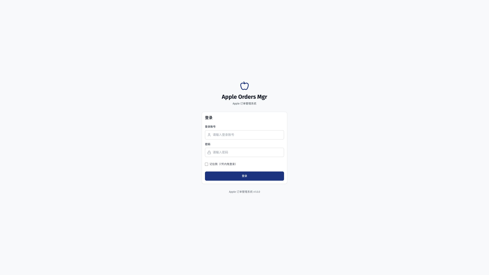

# 自有库存简化版生产发布记录

> 状态：已生产发布并启用，库存功能与生产技术验证通过；依赖安全审计未通过，用户真实业务验收待执行
>
> 发布时刻：2026-10-04 18:00:21（北京时间）
>
> 生产证据快照核对：2026-10-04 18:03:01（北京时间）
>
> 环境：`PP_CloudServer`、`https://apple.godp.me`；本次仅替换 API 与前端
>
> 代码基线：已推送的 `main@cb4382e9d98d9759669de0c9c1b01beed4fa371a`

## 发布结果与业务边界

[自有库存简化版方案](../../planning/自有库存简化版方案.md)已完成开发、独立验收、返工复测，按用户追加授权先合入主分支，再发布生产。现行入口为 `/stock`，一台手机一行，支持入库、跨仓售出、全额货款状态更新和历史销售补录。旧销售／回款页面重定向台账，旧复杂写接口退役；既有资料、只读、扫码附件及取货身份桥接保留。

生产 `stock_settings.enabled=true`、`version=1`。本次只执行一次启用配置命令，形成1条操作和1条审计；没有创建仓库、规格、人员、现货、销售或收款测试记录。旧取货2台设备仅回填为 `registered`，并保留2个来源关联，不能算作现货。

用户开始正常入库前，需要在“自有库存 → 仓库设置”中配置实际仓库名称。本次未替用户猜测或建立仓库；销售人、出货人和规格可在实际录入时直接填写。模块已启用不代表实际库存已盘点或历史销售已补齐。

脱敏证据见[发布验收结果](自有库存简化发布证据/发布验收结果.json)。[开发验证记录](2026-10-04-自有库存简化版开发验证记录.md)和[独立验收报告](2026-10-04-自有库存简化版独立验收报告.md)保留各自阶段事实，不以本次发布改写历史验证范围。

## 主分支整合与制品

| 项目          | 本次核对结果                                                            |
| ------------- | ----------------------------------------------------------------------- |
| 库存冻结提交  | `004d524d676da39680755666f96d8a6746418811`                              |
| 发布源提交    | 发布时本地与远端 `main` 均为 `cb4382e9d98d9759669de0c9c1b01beed4fa371a` |
| 发布制品      | `20261004T095424Z-786596e35218`                                         |
| 源树          | `786596e35218070f3805e4ce4f2c3c3e56010fb4`                              |
| 构建          | 干净 `main`，本地构建 `linux/amd64`，前端 API 基址 `/api`               |
| API 镜像      | `apple-order-mgr-runtime:20261004T095424Z-786596e35218-amd64`           |
| 正式 migrator | `apple-order-mgr-migrator:20261004T095424Z-786596e35218-amd64`          |
| 生产 current  | `/var/www/apple-order-mgr/releases/20261004T095424Z-786596e35218`       |

整合保留已有官网能力及主分支工作。4处冲突只涉及数据库文档、优化计划、测试指南和 `package.json`：文档取两侧完整主题，脚本取并集；依赖和锁文件不变。保全检查确认81个冻结文件、43个已有生产代码文件及12个原主分支代码文件内容一致。

开发、整合和构建在隔离工作目录完成。原用户目录 `/Users/seraph/GitHouse/AppleOrderMgr` 的935个保护文件均未变化，未用发布覆盖用户未提交工作。

## 备份、恢复与正式迁移

完整备份大小为 **3,143,818,452字节**，SHA-256 为 `9f228097221b8d0602e8ec3c0ea1be81cd6da924657bf7a8f84334992db673fc`，目录包含786项，备份与目录检查退出码均为0。完整备份已在独立 PostgreSQL 环境恢复成功，再以正式迁移程序演练；恢复及迁移退出码均为0。

演练前后迁移记录由64增至66，新增且仅新增：

1. `20261004000001-create-stock-management.js`
2. `20261004000002-simplify-stock-ledger.js`

72张旧表按迁移前的旧字段范围比较，核对口径如下，不能把只核对计数的表称为全量内容摘要一致：

| 比较范围                    | 数量 | 结果                                                                                            |
| --------------------------- | ---- | ----------------------------------------------------------------------------------------------- |
| 非空旧表的计数及旧字段摘要  | 67   | 前后相同                                                                                        |
| 空表计数，聚合摘要为 `null` | 3    | 仍为空；分别为 `proxy_assignments`、`quote_price_adjustments`、`quote_pricing_versions`         |
| 大表仅比较计数              | 2    | `monitor_log_entries` 27,474,556行、`order_mail_messages` 4,250行，前后相同；本轮未计算逐值摘要 |

生产正式迁移也为64→66；11张核心表的计数和摘要无变化。新增21张 `stock_` 表，旧取货2个来源关联保留，设备均为 `registered`。没有将旧取货扫码结果自动改成在库、销售或资金事实。

演练数据库和本次临时候选API的容器／卷已停止并移除；完整备份和回滚脚本保留。没有清理生产业务数据。

## 技术验证

| 层次       | 实际验证                                                                                                                                                        |
| ---------- | --------------------------------------------------------------------------------------------------------------------------------------------------------------- |
| 整合后端   | 96套／1,129项通过；33套／435项真实集成门禁测试显式跳过，跳过不算通过                                                                                            |
| 专项入口   | 库存单元6套／86项通过；官网7个JS套件已包含在全仓结果；官网宿主队列8项通过，不重复累加同一测试                                                                   |
| 静态与构建 | 后端lint 0错误／3,945警告；前端0错误／24警告，构建通过；文档198份可达、87模型字段覆盖；4个冲突文件格式及差异检查通过                                            |
| 本地交互   | 开发及独立验收已完成电脑与375×400手机合成数据操作、真实API保存及刷新读回，见对应历史报告                                                                        |
| 生产制品   | 公网11项静态资产摘要与本次制品一致，`/api/health/ready`、`/login`、`/stock` 入口检查通过                                                                        |
| 生产API    | 11项请求通过，包括一次管理员启用PATCH；管理员会话沿用现有安全会话，未在证据保留凭据                                                                             |
| 服务隔离   | API healthy、重启0、验收窗口错误日志0，API环境及挂载保持；12个原其他容器的ID、镜像、启动时刻和重启次数保持；受保护配置、Nginx、PostgreSQL及宿主官网队列状态不变 |

前端仍有共享构建包超过500KB的提示。官网Python队列测试首次在API容器因没有 `python3` 退出127，随后使用现有宿主Python和合成Docker桩完成8项验证，未安装新依赖，也未执行真实官网请求。保留失败尝试日志，不将环境缺失伪称通过。

### GitHub质量与安全门禁未全绿

合并提交的[GitHub质量与安全门禁](https://github.com/Seraph1211/AppleOrderMgr/actions/runs/37193522763)未全部通过，不能用本地测试或生产技术验证替代CI结果。后端其中2套测试依赖开发环境的测试密钥，已通过后续 `main@a46f742` 修复：只改 `test/profileManagement.test.js` 与 `test/officialOrderInput.test.js`，显式初始化合成测试密钥并恢复环境，运行时代码零改动。无开发密钥、故意保留无效旧密钥两种条件分别2套／39项通过，清空开发环境后全量96套／1,129项通过，33套／435项门禁跳过，lint／格式／差异检查通过。

[修复后的远程复跑](https://github.com/Seraph1211/AppleOrderMgr/actions/runs/37194326583)已结束：后端测试、两端lint、前端构建、文档检查和secret-scan通过；backend与frontend作业唯一失败步骤均为 `npm audit --audit-level=high`。测试初始化问题已关闭，依赖安全审计仍未通过，不能宣称CI全绿。后续测试和文档提交不改变本次已发布的 `cb4382e9` 业务制品。

依赖安全审计仍未通过：根目录报告37个high、3个moderate，前端报告7个high。这里是npm依赖报告条目数，包含间接依赖传播，不是独立漏洞数量。本次根目录与前端锁文件均与发布前生产相同，这些告警属于沿用依赖，不能表述为本次新增。原始结果为工作目录中的 `backend-audit.json`、`frontend-audit.json`。

截至2026-10-04核对，[braces官方安全公告](https://github.com/advisories/GHSA-vfj7-8cjw-p6xm)标明影响 `<=3.0.3` 且没有已修复版本。npm给出的部分依赖调整涉及Tailwind、Jest等大版本；不能把自动改依赖视作已验证修复。本次不降低或关闭原CI审计阈值，不执行强制大版本改造；已在优化计划登记独立的存量依赖治理，后续需核对运行时可达性、兼容性及完整回归，再报告安全门禁结果。

11项公网请求为：未登录健康检查200、匿名台账目录401、管理员设置读取／启用／再次读取、台账目录读取、在库／已售／全部三视图读取，以及原订单和取货列表读取。库存已认证响应带 `Cache-Control: no-store`。三视图 `total=0`、`items=[]`，与没有真实现货和销售的数据库状态一致。

生产核对后的数量为：`units=2`、`registered=2`；`products`、`parties`、可用仓库、`inStock`、销售、客户收款和公司到账均为0。启用只留下设置版本1、操作1条和审计1条。

## 浏览器及真实业务验收边界

生产浏览器仅核对未登录访问库存路由会进入登录页、该登录入口无error日志；**未执行生产登录后的PC/H5台账交互**。本次生产技术通过依据制品一致性、已认证公网API读回、正式迁移和服务隔离检查，不能替代用户真实业务验收。

用户后续需使用真实仓名和实物资料验收入库、售出及回款，并按真实资料补录历史销售。本次没有制造业务测试数据；未核验真实包装盒扫码、手机摄像头、真实OCR／OSS、实际交货、实际回款或历史账完整性。

## 回滚与证据位置

应用回滚脚本保留在 `/var/backups/apple-order-mgr/20261004T094629Z-stock-ledger/rollback-app.sh`。按已保存的API镜像和前端指针恢复应用，不重建无关Worker；**保留新增表、字段、设备身份、启用审计及后续业务数据，不执行删表down或数据库整体回灌**。有新业务后，迁移自身的down保护也会拒绝破坏性回退。本次未执行生产回滚。

本地原始证据位于隔离工作树 `tmp/stock-release/`：`main-preservation-check.json`、`backup-verification.json`、`rehearsal-before.json`／`rehearsal-after.json`、`rehearsal-summary.json`、`release-artifact.json`、`production-migration-summary.json`、`activation.json`、`public-verification.json`、`production-api-smoke.json`、`production-verification.json` 及 `merge-*` 检查日志。仓库内保留上述脱敏发布结果和登录入口截图，不保存账号、会话、完整订单链接或生产凭据。
