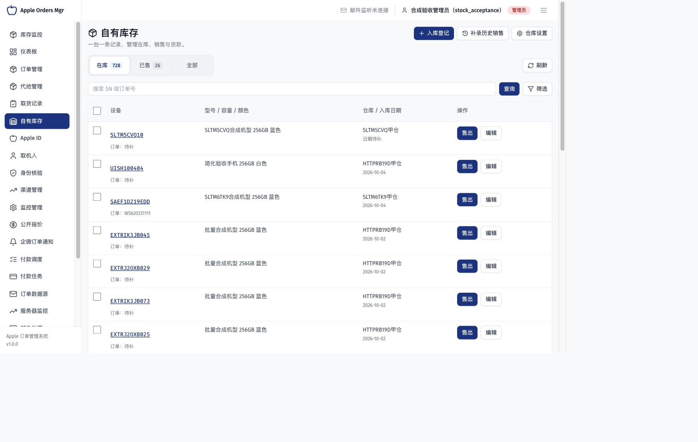
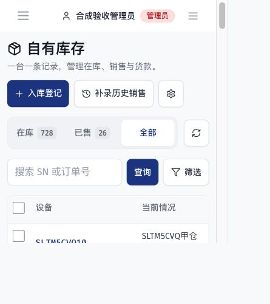

# 自有库存页签样式优化发布记录

> 状态：本地验证通过，生产发布待执行
>
> 最近核对：2026-10-04
>
> 适用范围：自有库存在库／已售／全部三个视图的前端展示
>
> 基线：main@e990e76；原生产制品20261004T095424Z-786596e35218
>
> 验证范围：本地合成台账PC/H5交互、静态检查；生产结果完成后补记

## 改动与验证

三个独立按钮改为统一浅灰底分段页签，白底蓝字表示选中，数量独立徽标；三项等宽、触控高度44px，鼠标选中不额外显示键盘焦点圈，键盘焦点保留。接口、数据、权限、筛选与地址参数未改。

本地真实API读取现有合成台账：在库728、已售26、全部754，三视图逐个切换只选中一项，地址参数与列表总数一致；刷新保留全部视图。1440px电脑完成Tab与Enter切换，375×400手机短屏三项同排，文档滚动宽356px、小于375px视口，无整页横溢。浏览器error日志0。只执行查询，不新建或更改业务数据。

前端Lint 0错误／24项沿用警告，Vite构建通过；文档检查199份可达、87模型字段覆盖。构建仍有既有大包提示。本次不更改依赖锁文件；此前依赖安全审计未通过的问题见[库存生产发布记录](2026-10-04-自有库存简化版生产发布记录.md)，不宣称全量CI已通过。

[本地交互核对](自有库存页签优化证据/本地交互核对.json)。这是样式与只读视图技术验证，不替代真实库存和资金业务验收。

## 生产发布

待合入主分支并推送后，从干净main构建前端制品，备份原指针及发布配置，再原子切换静态资源。只更新前端，保留API和Worker镜像及容器、数据库、共享配置和宿主服务；不执行Migration。
