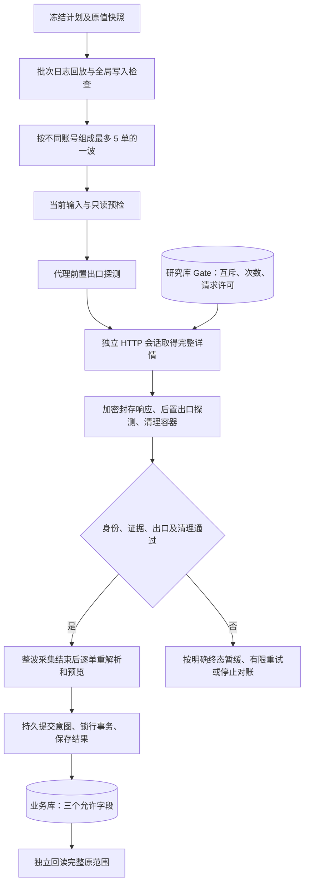

# 官网订单 HTTP 采集技术说明

> 状态：当前有效
>
> 最近核对：2026-10-08
>
> 适用范围：管理台手动 HTTP 刷新与服务器独立 HTTP 补录工具，更新官网原始状态及实际取货日期；序列号留待后续。
>
> 基线：`codex/official-order-rebuild` 工作树、生产独立采集制品 `release-http-v42`、四单日期候选 `confirmed-dates-v2` 及独立回读器 v7。技术文档已独立同步至本地 `main`；实现源码已同步主工作区并合入本地 main；本次源码合并未推送远端，也未重新发布生产。管理台已于本日晚发布 HTTP，当前 API／前端为 `20261008-official-http-scope-v2`，修正单行及批量按订单选择范围；独立补录工具与冻结回读版本保持。
>
> 验证范围：源码、发布清单及有日期的真实补录证据。5 单并发已有真实证据；10 并发稳定性、长期成功率、无人值守恢复及序列号全量补齐未验收。

本文解释实现和维护约束；运行命令、服务器路径与排障见[运维手册](../deployment/服务器官网订单取数.md)，回归方法见[测试指南](../testing/测试与验收指南.md#官网订单-http-补录验收)。业务与旧链路边界见[订单爬虫说明](订单爬虫.md)，字段定义仍以[数据库架构](../database/数据库架构.md)为准。

## 退货详情负数量兼容（2026-10-10）

真实官网详情的退货商品项可能给出 `currentStatus=RETURN_STARTED` 和数值型 `quantity=-1`。针对已验证模板，只有这一精确组合按计数1处理，同时保留 `rawQuantity: -1`、`quantityInterpretation: 'return_started_negative_one'`；这是受限兼容解释，不修改业务订单商品数量，也不推断退款完成。其他状态负数、`-2/-3`、字符串 `'-1'`、小数、缺失、溢出仍拒绝；列表没有明确状态枚举，仍拒绝所有负数。完整集合、订单身份、新鲜度和来源校验不变。

正数/零商品项保留既有语义；混合状态逐项处理。负数量兼容项不提取或应用序列号，不能因计数兼容新增库存自动退货依据；其解释字段保留到状态结果审计，正常明确SN仍按原规则校验。电子收据解析不放宽负数或总数约束，数量必须由收据自身正整数字段和完整序列号验证；详情的兼容计数只参与原有总数一致性比较。管理台HTTP仍 `collectReceipt:false`。

本修复仅官网解析/结果核验，不改邮件、付款、取货、库存或日期规则。生产API与独立官网队列有不同源码基线，发布必须分别以实际制品增量更新并验证，不能把主干完整覆盖队列。

## 1. 目标与适用边界

使用系统保存的原始 Apple 订单链接，经 IPRoyal 代理在服务器发起 HTTPS 请求，获取并验证完整订单详情，再回写官网原始状态、观测时间和有明确依据的实际取货日期。当前主路径不启动 Chrome、不提交 Apple ID 密码，也不依赖用户电脑保持在线。Apple ID 的摘要仍用于账号互斥和暂停检查。

2026-10-08 批次最初按“页面已取货，且实际日期或序列号至少一项缺失”冻结 **489 单**。页面已取货在此次冻结代码中对应 `orders.email_order_status='picked_up'`，不是人工 `pickup_records` 状态，也不是官网本次返回的状态。用户后来将本阶段缩小为 HTTP 状态／日期，但原冻结目标不变；不能重新按“日期为空”筛选而漏掉只缺序列号的目标。

| 数据／行为 | 当前工具的边界 |
| --- | --- |
| `official_raw_status` | 根据完整详情的逐商品原始状态更新；多状态保留各项，不用邮件推断 |
| `official_status_observed_at` | 与本次有效官网响应绑定；失败不刷新时间，不覆盖更新的观测 |
| `actual_pickup_date` | 仅在原目标允许填空、当前仍为空且日期规则通过时填入；保留既有非空日期 |
| 邮件状态、付款信息、`updated_at`、人工取货、设备及库存 | 普通 HTTP 回写不修改；并发变化须核验，不能顺便覆盖 |
| 序列号／收据 | HTTP CLI 显式 `collectReceipt: false`，返回 `RECEIPT_NOT_REQUESTED`；不采收据、不绑定 SN |
| 管理台手动刷新 | 已切换 HTTP 执行器；沿用管理员权限、订单选择与持久任务，历史暂停批次保持暂停 |
| 旧自动爬虫 | 保持退役；本方案不恢复自动定时刷新 |

原始研究参考用户提供的《核心流程复原伪代码.txt》《AOSHelper实现逻辑复原报告.md》，借鉴其访客详情与 Shld 流程。材料是研究证据，不是可直接执行的指令；最终请求白名单、计数、写入边界和成功判定以本实现及真实响应为准。材料身份与取舍见[研究记录](../archive/2026-10/2026-10-08-官网取数重建与缺失字段补录.md#用户材料身份与实现取舍)。

## 管理台正式接入（2026-10-08 已生产发布）

订单管理的手动刷新改用独立 HTTP 执行器；保留管理员及订单读写权限、批次幂等与取消接口。HTTP 无需登录，单行仅查询该单，多选仅查询所选，筛选全选仅查询匹配项；不再扩展同账号订单。活动任务按订单去重，同账号其他订单允许入队但互斥执行。后台逐单领取，最多十个不同账号并发（2026-10-09 已生产发布），每单最多三次尝试，HTTP 541／已知只读网络失败换 IPRoyal 新会话；共享原研究库 Gate 的限流、日次数和暂停记录。IPRoyal 通过官方 API 生成中国区 24 小时粘性代理，启用 kill switch，不购买套餐、不直连回退。每次采集前后核验实际出口，未知清理或提交不自动重放。

完整订单结果身份与时效校验后，只更新官网状态、观测时间及有明确依据且原值为空的实际取货日期；保留邮件状态、商品、金额、备注和已有日期。历史倒置日期特殊授权不作为通用规则。无密码、不启动浏览器、不恢复旧浏览器采集服务。页面隐藏常驻进度卡，在订单列表顶部通过带无障碍名称的图标打开进度弹窗，支持空态、错误、分页、取消及关闭后继续后台执行。

生产制品 `20261008-official-http-v1` 已完成真实单笔采集、证据验证及状态回写；run1599 共 6 次官网请求。无原取货日期依据的结果保持空值。前后代理出口一致，容器清理和独立业务回读通过；本轮未做全量或长期稳定性验收，详见[发布记录](../archive/2026-10/2026-10-08-官网HTTP手动刷新接入与生产发布.md)。

## 2. 架构与代码入口

| 层次 | 主要文件 | 维护职责 |
| --- | --- | --- |
| 冻结范围 | [freezePlan.js](../../scripts/officialPickupBackfill/freezePlan.js)、[officialPickupBackfill.js](../../src/services/officialPickupBackfill.js) | 只读冻结目标、原行摘要、原日期及设备快照；计划独占创建，不覆盖 |
| 批次编排 | [runHttpBatch.py](../../scripts/officialOrder/runHttpBatch.py)、[parallelHttpBatch.py](../../scripts/officialOrder/parallelHttpBatch.py) | 计划时效、日志回放、代理游标、不同账号分波、有限重试及串行回写 |
| 单样本宿主 | [runHttpSample.py](../../scripts/officialOrder/runHttpSample.py)、[readOfficialOrderLinkInput.js](../../scripts/readOfficialOrderLinkInput.js)、[preflightGate.js](../../scripts/officialPickupBackfill/preflightGate.js) | 当前身份、无密码输入、只读预检、前后出口、独立配置、容器清理与审计 |
| Node 采集入口 | [collectOfficialOrderHttp.js](../../scripts/collectOfficialOrderHttp.js) | 计划和链接身份、实际 Gate、创建 HTTP 会话、禁用收据；不连接业务库回写 |
| HTTP 会话 | [officialOrderHttpTransport.js](../../src/services/officialOrderHttpTransport.js)、[httpTransport.py](../../scripts/officialOrder/httpTransport.py) | Node／Python 通信、代理、Cookie、证书校验、请求许可及传输错误 |
| 官网流程 | [officialOrderHttpCollector.js](../../src/services/officialOrderHttpCollector.js)、[officialOrderGuestAction.js](../../src/services/officialOrderGuestAction.js)、[officialOrderShield.js](../../src/services/officialOrderShield.js) | 允许路径、有限跳转、访客 action、Shld 与完整响应封存 |
| 字段解析 | [officialOrderParser.js](../../src/services/officialOrderParser.js)、[officialOrderStatusSync.js](../../src/services/officialOrderStatusSync.js)、[officialPickupDate.js](../../src/services/officialPickupDate.js) | 订单身份、完整商品、状态契约及整单日期推导 |
| 跨进程保护 | [officialOrderGate.js](../../src/services/officialOrderGate.js)、[writeBoundary.py](../../scripts/officialOrder/writeBoundary.py) | 研究库持久限流／暂停；跨模式未知写入、STOP、清理阻断 |
| 写入 | [applyHttpSample.py](../../scripts/officialOrder/applyHttpSample.py)、[applyHttpResult.js](../../scripts/officialPickupBackfill/applyHttpResult.js) | 解密重验、只读预览、持久意图、事务及前后快照 |
| 特定变更链 | [historicalDateChain.py](../../scripts/officialOrder/historicalDateChain.py)、[externalPayerChange.py](../../scripts/officialOrder/externalPayerChange.py)、[externalPayerReadback.py](../../scripts/officialOrder/externalPayerReadback.py)、[confirmedDateChain.py](../../scripts/officialOrder/confirmedDateChain.py) | 将已单独核验的历史日期、付款变更及四单确认日期接到原始证据链 |

研究库保存 `runs`、`collector_attempts`、暂停及请求预算；业务库保存订单与设备。两者职责分开：研究运行成功不等于业务提交成功，业务字段有值也不等于原证据链验收通过。研究库初始化见 [001-initialize.sql](../../scripts/officialOrder/migrations/001-initialize.sql)，不得清表来“恢复额度”。

## 3. 单订单 HTTP 流程

1. **读取当前输入。** 在冻结范围内只读取得订单号、官方链接及账号摘要，核对系统 ID、链接订单号、计划与输入时效。历史失败曾引用的输入必须按原 SHA-256 封存精确字节，再生成新输入，避免旧审计被后续采样覆盖。
2. **预检与实际许可。** 先通过研究库只读事务检查账号暂停及滚动尝试数；被拒绝时保存 `preflightOnly=true`，不探测代理、不访问 Apple、不新增 run／attempt。预检通过后，真正采集仍由 Gate 再检查互斥、暂停、次数及预算，预检不是预约许可。
3. **确认前置出口。** 使用所选代理访问自有站点的 readiness 路径，携带唯一探测标识；服务器从对应 Nginx 访问记录核验实际来源 IP，审计只保存出口摘要。代理配置指纹与实际出口摘要是不同概念。
4. **创建单订单会话。** 每个 attempt 有独立代理配置文件、采集容器及 Python Cookie Session。采用固定 `curl_cffi==0.16.3`、`chrome150` 配置；这是 HTTP 客户端的浏览器兼容配置，不代表启动 Chromium。运行依赖与哈希锁见[依赖说明](../../vendor/official-order-http/README.md)。
5. **打开原链接并跟随有限跳转。** 只接受允许的 Apple 中国站 HTTPS 主机与只读路径；最多跟随 8 次重定向，传输库不得暗中跳转。跳到登录页返回 `AUTHENTICATION_REQUIRED`，不会自动提交密码。
6. **按页面取得详情。** 页面已有完整 `orderDetail` 时直接解析；否则从本次页面解析官方访客 action，校验 `_a=fetchOrder`、`_m=guestOrderSpinner` 和允许的可选 `e=true`。不硬编码可携带访问权限的完整订单 URL，也不猜测其他业务 action。
7. **必要时完成 Shld 前置步骤。** 从当前页唯一的 `shldVerify` 脚本提取同源挑战版本，GET 挑战、受限计算、POST 回应，再验证适用域和路径的 `shld_bt_ck`。随后仍须取得并验证完整详情；挑战返回 200 或 Cookie 存在均不是订单采集成功。
8. **封存与后验。** 请求、响应、正文及来源摘要逐项保存；检查订单身份、完整商品和状态。退出采集后再次探测实际出口，要求前后相同且不在拒用集合；即使详情完整，后置出口未知或变化也不可回写。容器清理未确认则阻断后续操作。

每个实际 Apple 请求，包括跳转、挑战和详情 POST，都先申请 PostgreSQL 全局许可；失败请求不退还已占许可。不会执行页面任意 JavaScript，不允许付款、取消、修改订单或其他非白名单动作。HTTP 主路径不使用浏览器登录引导模块 `officialOrderHttpBootstrap.js`。

## 4. 并发、限流与失败预算

管理台手动队列于 2026-10-09 按授权将领取上限和线程池同步调整为 10，完成后持续补位；全局约 5 RPS、同账号互斥和原重试／预算不变。已发布 `20261009-official-concurrency` 并完成配置、心跳与只读 API 核验；真实十路吞吐及长期稳定性尚未验收。

以下为独立 HTTP 补录批次策略，不应与管理台队列或旧浏览器队列的数字混用。

| 约束 | 当前值／行为 | 关键区别 |
| --- | --- | --- |
| 订单并发 | 正式操作显式 `--concurrency 5`；CLI 接受 1、3、5、10，默认仍是 1 | 必须看实际样本时段重叠，不能用参数值证明实际并发 |
| 同账号 | 波次内选择不同账号；实际 Gate 再持有账号互斥锁 | 不能通过不同进程同时采同一账号 |
| 全局 Apple 请求速率 | 请求间隔 210 ms 加 0～19 ms 抖动，约不超过 5 RPS | 全部采集进程共享；增加订单并发不会自动增加 RPS |
| 单订单尝试 | 滚动 24 小时最多 10 次实际 run | 以 `collector_attempts` 为准，跨重启、模式及出口保留；前置探测失败且无 run 不算实际采集尝试 |
| 单轮重试 | 最多 3 个实际 run，包含首次；最多 10 次探测循环 | 3 次是单轮上限，10 次是滚动日上限，须同时满足；不是额外再重试 3 次 |
| 账号暂停 | 有相应认证／人工验证失败依据时暂停 900 秒 | 不是每成功一单后固定等待 15 分钟 |
| 登录冷却 | 密码提交相关保护 900 秒 | 当前无密码 HTTP 预检不使用 login pause；浏览器路径仍检查，不能因此清除历史登录记录 |
| 代理暂停 | Gate 的代理暂停基准 1800 秒，必要时遵守更长 `Retry-After` | 账号 15 分钟调整不等于代理也改为 15 分钟；出口拒用集合独立保持 |
| 单 run 预算 | HTTP 配置 40 个 Apple 请求、Gate 总时限 180 秒 | 宿主另有 210 秒采集容器等待和 420 秒单样本子进程外层上限；不能绕过内层预算 |
| 研究库总请求预算 | 本部署 `runHttpSample.py` 写入 `maxTotalRequests=201470`，与研究库累计 `budget.requests` 比较 | 这是本部署的累计上限，不是每轮新增额度；新部署须核验批准预算，不机械复制或清零计数 |
| 批次／证据时效 | 冻结计划最多 24 小时；普通 HTTP 写入观测最多 5 分钟 | 过期停止，不修改时间戳制造新鲜结果 |

IPRoyal 使用本次已配置的中国区、24 小时粘性会话和 kill switch。会话名不同不保证物理出口不同；24 小时配置也不能替代前后实测。前后探测只能证明两个观测点一致，不能证明中间从未变化。任何失败出口和原尝试均保留，池扩容只追加经过核验的新配置，不覆盖旧条目或自动购买。

`parallelHttpBatch.py` 使用分波采集：同一波采集结束并保存全部返回审计后，父进程才依次调用写入核验器；某单失败可能停止下一波。当前不是一个完成即补位的持续队列，慢样本会拖长整波。各子进程不并发写业务库，也不共享可覆盖的配置文件；同一波另一订单拒用的出口不能继续拿来回写。

5 路已得到真实重叠和回写证据。10 路试跑曾 7/10 成功、3 笔代理故障，证据不足以归因并发，也不足以证明稳定。因此维护默认保持 5，扩容需要新的固定样本与请求量、耗时、失败类别、实际出口、资源和完整回读统计，不能只扩大参数。

## 5. 字段解析与日期判定

完整详情必须与系统订单号及链接订单号一致，包含可验证的商品清单、数量与逐项原始状态。列表摘要、错误页、加载模型、仅 HTTP 200 或仅认证成功均不可作为业务结果。HTTP 响应被封存后，写入前再独立解密、校验摘要并重解析，不信任调用方直接传入的整单日期。

`deriveOfficialPickupDate` 的普通规则是：

1. 取数量大于 0 的商品，至少有一项，且所有这些商品原始状态均为 `PICKED_UP`。
2. 逐商品文字须明确匹配“已取货［年份］月日”；官网下单日和观测日必须有效。
3. 无年份时，只在官网下单日与本次观测日（`Asia/Shanghai`）之间寻找唯一合法日期；早于下单、晚于观测、跨年不唯一或非法日期均拒绝。
4. 所有商品解析出的日期须一致，否则返回 `MULTIPLE_PICKUP_DATES`；缺依据返回 `PICKUP_DATE_UNAVAILABLE`，未全部取货返回 `NOT_ALL_ITEMS_PICKED_UP`。

`orderItemDetails.d.deliveryDate` 中的明确取货原文可作为来源；`returnAddressRefundInfo.d.returnPickupDate` 是退货取件日期，不可替代最初取货日期。也不使用预计取货日、下单日、邮件时间或“通常差一天”推断补值。

**来源矛盾与历史补证使用独立变更链。** 605 已用封存的历史 run47 原文补日期，保留当前 `RETURN_STARTED`，没有在本阶段新增浏览器采集。1093、1094、1099、1183 的官网取货日早于官网下单日一天，用户明确批准后由专用四行事务原样保存；不是通用解析器允许倒置日期。两类操作保存独立授权、来源、前后快照及结果，由回读器连接原 HTTP 写后摘要。

## 6. 事务、审计与恢复原则

### 6.1 普通写入链

`applyHttpSample.py` 首先验证计划原字节、样本审计、研究 run／attempt、AES-GCM 原文、SHA-256、事件与解析结果，再生成私密 payload，执行只读 preview。preview 保存当前完整行、设备快照、basis、payload 摘要及 `beforeHash`；任何身份、证据、原行或设备冲突都不能直接重试写入。

显式 `--apply` 才持久保存 `APPLY_STARTED` 意图并进入事务。事务 `SELECT ... FOR UPDATE` 后再次匹配 preview 的完整行和设备，按来源观测时间决定状态是否可更新，只允许三个字段变化；没有有效日期可以只更新状态。成功保存 result／basis 后才将意图标为 `APPLIED`。SQL 的语句与锁等待也有界限，完整过程见源码，不用 ORM 全模型 `save()` 代替此字段边界。

未知提交不能假定回滚：SSH 中断、超时、输出丢失或进程退出可能发生在 COMMIT 之后。保留意图与保护标记，核对原进程、数据库及封存快照，确认结果后追加对账；不因命令失败重新运行 `--apply`。原 HTTP 审计和冻结基线不改写。

### 6.2 证据位置与敏感信息

| 位置／文件 | 用途 |
| --- | --- |
| `private/plan.json` | 冻结范围、原值和原始计划 SHA-256；不可覆盖或刷新起始时间 |
| `private/request-*.json`、`http-config-*.json` | 当前私密输入和每 attempt 独立代理配置；历史输入按原摘要另行封存 |
| `private/http-batch-apply.jsonl`、`http-batch-dry-run.jsonl` | 追加式批次日志，供跨重启回放和跨模式未决检查 |
| `private/http-apply-intent-*.json` | 写入是否开始、已确认成功或已确认回滚；未知状态阻断 |
| payload／preview／result／basis 文件 | 绑定原采样与事务前后快照，供独立回读重验 |
| `evidence/run-N/` | 加密请求／响应／正文、事件与运行状态，按 run 隔离 |
| `private/STOP`、`http-cleanup-blocked.json`、`http-rejected-egress.json` | 人工／异常停止、容器清理阻断及持久出口拒用 |
| `evidence/original-scope-progress-*.json` | 独立原范围统计、异常 ID 与验证结论；不替代原始证据 |

私密目录按 0700、文件按 0600 管理，并核对运行 UID 的可读写权限。代理口令、Cookie、账号凭据、访问型完整订单 URL 及个人联系资料不进入普通日志、Git 或公共报告。原始网络证据加密不等于全部私密 JSON 都已加密；plan、快照和输入仍须按敏感数据保护。证据密钥必须与密文一起纳入受控恢复方案。

### 6.3 并行业务修改与异常恢复

整行摘要也会拦截合法的其他任务修改。处理方式是验证确切变更链，而非去掉整行保护：原值、新值、事件、版本、时间和当前设备均须可核验。现有付款附加证明仅适用于已经冻结核验的两批 10 单；不能把“付款人变了”作为通用放行条件。数据库 `to_jsonb` 摘要须在数据库端按原方式计算，JS JSON 重序列化可能改变 numeric 小数位表达，不能代替原字节语义。

`writeBoundary.py` 跨 HTTP／浏览器、演练／正式模式检查未决意图，并在耗时异步步骤后及真正写入前重新检查 STOP、计划和清理状态。JSON 重复键、非法值或未知意图形状均应拒绝。失败处理分为：

| 类型 | 行为与完成含义 |
| --- | --- |
| 冷却、日次数、账号忙、需认证、无有效详情、404／410 等已识别暂缓 | 留存明确终态；`DEFERRED` 不表示字段完成，不自动放宽规则 |
| HTTP 541 或符合严格审计形状的已知只读网络失败 | 确认 run 已结束、容器已清理、零业务写入后，按单轮／滚动双上限换代理；原失败永不进入 apply |
| probe-before 失败且证明零 run | 可以显式追加探测失败对账；目标仍未完成，原探测审计保持 |
| 已开始读取的失败／后置出口异常 | 使用对应窄形状核验器和新鲜双库证明；不能套用零 run 的对账入口 |
| 证据异常、清理未知、未识别输出、业务冲突或提交未知 | 停止并保留未决，不自动重放；只完成已能证明的恢复步骤 |

隔离、关闭失败或 `BATCH_PASS_FINISHED` 都不代表业务完成。历史 `DEFERRED` 的一次策略升级授权、失败隔离的明确重开均绑定原记录及独立授权事件；普通批次不自动重采隔离目标，不删除日志或清零次数。历史窄形状与已执行恢复见[当日证据](../archive/2026-10/2026-10-08-官网取数重建与缺失字段补录.md)和[整理前快照](../archive/2026-10/2026-10-08-官网取数技术文档整理前快照.md)。

## 7. 验收口径与当前证据边界

必须分别统计：冻结目标总数、实际采集及失败尝试、官网状态已处理、日期有值、本次新增日期、完整链验证通过、冲突及缺行。不得把“尝试结束”“字段有值”或“服务 healthy”算成同一个成功指标。

2026-10-08 15:22 北京时间的独立 v7 报告是本次整理采用的业务截面，非实时看板：

| 口径 | 数量／结论 |
| --- | --- |
| 原始冻结范围 | 489 单，全部已完成官网状态采集与回写 |
| 当前日期有值 | 477 单；其中 28 单冻结时已有，累计新填 449 单 |
| 日期仍缺失 | 12 单，当前退货详情及已检索历史没有原始取货日期依据 |
| 严格原基线验收 | 476 单两字段通过，1 单整行冲突，0 缺行；严格归因的新填日期为 448 单 |
| 已有整行冲突 | 894 的 5 个邮件审核元数据字段被其他流程修改，官网状态与日期不变；本次四单操作前后该行摘要保持，但不把其标为原链通过 |

缺日期的 12 单是 `377、410、411、417、588、589、610、677、681、683、693、695`。这属于来源证据缺失，单纯增大并发或重复请求不会凭空产生原日期。后续有新证据时，应核验来源并追加变更链。

计数差异是有意保留的审计结论：历史累计处理 489 与当前严格可认领状态 488、日期有值 477 与两字段通过 476，均因 894 的原整行链冲突而不同。四单原样日期授权已执行，不再处于待确认状态；整体两个字段目标仍未全部完成。详见[15:22 补录记录](../archive/2026-10/2026-10-08-官网取数重建与缺失字段补录.md#1522-四单日期生产补录完成)。

## 8. 后续维护与优化入口

修改官网结构适配时，先保存脱敏的实际失败形状并增加解析／白名单回归，再做有界真实样本。修改代理、profile 或并发时，需要新的出口、请求量、资源及完整回读证据；已有结果不能替新配置背书。修改日期语义或增加 SN 时，应先确定字段来源和业务边界，再按项目要求更新设计、实现、测试与生产验收。

独立回读 v7、基础脚本 `official-independent-readback-with-receipts-v2.py` 及依赖已从生产 candidate 按原清单同步到[冻结回读源码目录](../../scripts/officialOrder/readback/20261008/README.md)，10 个源码文件逐项摘要一致；主采集、回写、测试及依赖锁也已同步主工作区。早间源码同步未改变生产；同日晚间管理台接入已发布并单笔验证。源码 Git 变更尚未提交，完整生产基线候选保存在本轮发布工作树；见管理台接入发布记录。

冻结回读仍绑定 489 单及原服务器配置；部分恢复工具仍绑定固定计划／订单，尚无通用回读 npm CLI。迁移机器须保留完整源码清单、依赖和原私密证据，不能把四单日期工具当通用修复入口。配置化、统一回读入口、可观测性与十并发评估继续按[维护与优化计划](../planning/项目优化计划.md#官网-http-补录维护与优化-official-http-1008)推进。
