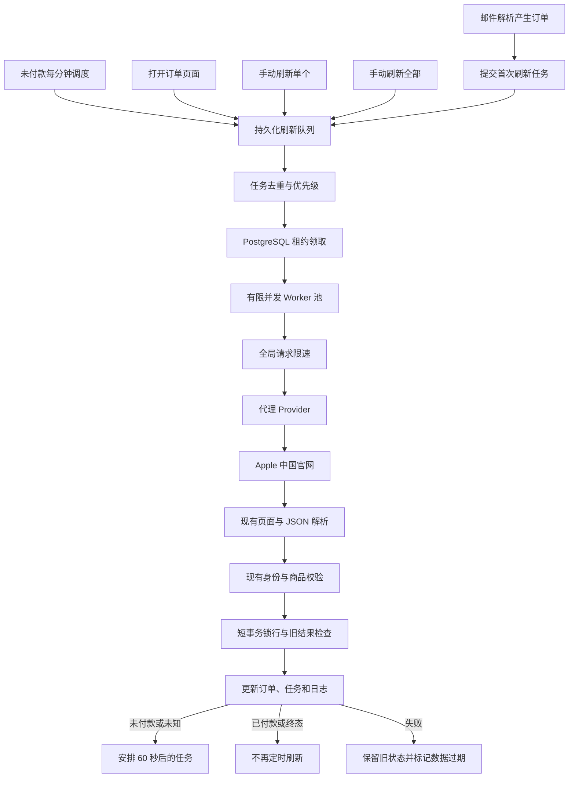

# 订单状态刷新与爬虫重构方案

> 状态：核心队列、交互、解析修复和代理安全切换已完成开发实现；代理稳定性、模块拆分、Fixture 和生产验收待完成
>
> 最近核对：2026-09-07
>
> 适用范围：邮件入库后的 Apple 官网订单状态刷新、人工刷新、调度、代理、任务状态和前端反馈
>
> 基线：`main@79e83e0` 与当前工作树
>
> 验证范围：Jest、隔离 PostgreSQL Migration/并发负载、快代理隧道/私密代理、Apple 中国首页及用户授权的 83 条真实订单链接只读 A/B；未验证真实订单写库、邮箱、完整 Worker/API/前端切换流程和生产环境

本文档承接[订单爬虫与代理策略](../design/订单爬虫.md)的实施改造。数据库队列、异步接口、Worker、限流、代理 Provider 和前端进度已进入当前工作树；本文仍保留未完成任务与分层验收边界，不能把本地开发证据写成真实订单或生产验收。

## 一、已确认需求

1. 支持自动刷新和手动刷新；手动刷新包括刷新单个订单和刷新全部订单。
2. 邮件解析出订单号和订单链接后，继续根据订单链接访问 Apple 中国官网；现有页面解析、身份校验、商品比对和数据写入规则保持不变。
3. 未付款订单每分钟刷新一次。付款窗口只有 30 分钟，同一时间可能存在上百条待付款订单。
4. 已付款订单不执行定时刷新；打开订单页面时自动刷新，或由用户手动刷新。
5. 允许完整重构爬虫业务模块，但不能把待实施方案写成已实现能力。

## 二、目标与边界

### 2.1 目标

- 让每个未付款或支付状态未知的订单每 60 秒至少获得一次刷新尝试。
- 使用持久化任务和租约，保证 API 或 Worker 重启后任务不丢失，多 Worker 不重复处理同一订单。
- 统一自动、页面打开、手动单个和手动全部四类刷新入口。
- 在上百个待付款订单下控制并发、代理频率和重试放大，避免单条失败阻塞整批。
- 前端明确展示待付款订单、数据新鲜度、刷新进度和失败原因。
- 保留现有解析和业务校验规则，并建立脱敏 HTML Fixture 回归保护。

### 2.2 本方案不包含

- 改变邮件模板识别和订单链接提取规则。
- 改变 Apple 页面字段、商品匹配、取消订单数量或金额解析的业务口径。
- 把 Apple 官网支付状态用于推导内部付款人结算状态。
- 未经单独授权购买代理、执行生产 Migration、部署、重启或访问真实订单。

## 三、刷新策略

| 订单状态                   | 自动定时刷新 | 打开页面 | 手动单个 | 手动全部 |
| -------------------------- | ------------ | -------- | -------- | -------- |
| 新建、尚未完成首次官网同步 | 每 60 秒     | 去重触发 | 支持     | 支持     |
| 支付状态未知               | 每 60 秒     | 去重触发 | 支持     | 支持     |
| 未付款                     | 每 60 秒     | 去重触发 | 支持     | 支持     |
| 已付款                     | 不定时刷新   | 自动触发 | 支持     | 支持     |
| 已完成、已取消及其他终态   | 不定时刷新   | 可触发   | 支持     | 支持     |
| 身份或商品校验异常         | 暂停自动刷新 | 可提示   | 受控执行 | 受控执行 |

实施默认口径如下：

- 邮件成功创建订单后立即提交首次刷新任务。
- 支付状态未知时按未付款处理，直到官网成功返回明确状态。
- “每分钟刷新”指每个符合条件的订单在连续 60 秒内至少发起一次刷新尝试；外部网络或官网失败时不能伪造成功。
- 识别为已付款后立即取消后续定时计划，但保留页面打开和手动刷新能力。
- 打开订单列表时只刷新当前分页可见的已付款订单；打开订单详情时只刷新当前订单。
- 手动“刷新全部”默认包含所有具有合法 Apple 订单链接的订单，不按付款或终态排除。
- 同一订单已有待执行或执行中任务时，新的页面或手动触发与现有任务合并，不重复访问 Apple。

## 四、目标架构



核心原则是触发与执行解耦：API 和页面只提交任务，独立 Worker 负责限速、代理访问、解析、校验和写入。

## 五、任务模型

采用 PostgreSQL 持久化队列，当前规模不新增 Redis。正式字段和索引须在开发前先写入[数据库架构](../database/数据库架构.md)，再通过 Migration 实现。

### 5.1 `order_refresh_schedules`

每个订单一条调度状态，避免调度字段改变订单业务行的 `updatedAt`。

| 字段                   | 用途                                   |
| ---------------------- | -------------------------------------- |
| `order_id`             | 订单主键，一对一                       |
| `next_auto_refresh_at` | 下一次未付款自动刷新时间；已付款时为空 |
| `last_attempt_at`      | 最近一次实际发起请求时间               |
| `last_success_at`      | 最近一次成功写入时间                   |
| `last_failure_at`      | 最近一次最终失败时间                   |
| `consecutive_failures` | 连续失败次数                           |
| `freshness_status`     | `fresh/stale/refreshing/failed`        |
| `updated_at`           | 调度状态更新时间                       |

### 5.2 `order_refresh_jobs`

每次实际执行对应一条任务记录。

| 字段                 | 用途                                       |
| -------------------- | ------------------------------------------ |
| `id`                 | 任务 ID                                    |
| `order_id`           | 目标订单                                   |
| `trigger`            | `auto/page_open/manual_single/manual_all`  |
| `status`             | `pending/running/succeeded/failed/skipped` |
| `priority`           | 调度优先级                                 |
| `scheduled_at`       | 最早执行时间                               |
| `lease_owner`        | 领取任务的 Worker                          |
| `lease_expires_at`   | 租约到期时间                               |
| `attempt_count`      | 已执行请求次数                             |
| `last_error_code`    | 结构化错误码                               |
| `last_error_message` | 脱敏错误摘要                               |
| `batch_id`           | 手动全部刷新批次，可为空                   |
| `requested_by`       | 人工触发用户，可为空                       |
| `started_at`         | 开始时间                                   |
| `finished_at`        | 结束时间                                   |

数据库应保证同一订单最多只有一个 `pending/running` 任务。重复请求不创建第二次官网访问，而是关联现有任务或提升优先级。

### 5.3 `order_refresh_batches`

记录手动刷新全部的总数、待执行、执行中、成功、失败、跳过和完成时间。运行中再次点击“刷新全部”时返回现有批次，不重复创建全量任务。

### 5.4 `crawl_logs`

继续承担抓取执行审计和排障。任务状态与抓取日志职责分离：任务表回答“是否排队和完成”，日志表回答“请求、解析或写入为什么成功或失败”。原始响应和错误信息继续遵守敏感数据最小化与脱敏要求。

## 六、调度、优先级与去重

Scheduler 每 5 秒领取到期任务，但不会每 5 秒抓取所有订单。任务使用数据库事务和 `FOR UPDATE SKIP LOCKED` 领取，并写入带期限的 Worker 租约。

优先级由高到低：

1. 手动刷新单个订单。
2. 已超过 60 秒的未付款或未知订单。
3. 页面打开触发的已付款订单。
4. 手动刷新全部产生的批量任务。

调度规则：

- 必须为到期未付款任务保留执行容量，批量刷新不得使其超过 60 秒未发起请求。
- Worker 异常退出后，其他 Worker 可在租约过期后重新领取。
- 页面重复加载、用户重复点击、自动任务与人工任务同时到达时，按 `order_id` 合并。
- 手动刷新单个订单可提升现有待执行任务优先级；已有请求正在执行时直接观察该任务结果。
- 最终失败后保留下一分钟的正常自动刷新机会，不能在同一分钟无限快速重放。

## 七、模块拆分

```text
src/services/crawler/
├── appleOrderFetcher.js
├── appleOrderParser.js
├── orderValidator.js
├── orderPersistService.js
├── refreshPolicy.js
├── refreshJobService.js
├── refreshJobRepository.js
├── crawlerRateLimiter.js
└── proxy/
    ├── proxyProvider.js
    ├── kdlTunnelProvider.js
    └── kdlPrivateProvider.js
```

| 模块                   | 单一职责                                       |
| ---------------------- | ---------------------------------------------- |
| `appleOrderFetcher`    | 通过代理访问 Apple、处理超时并返回页面         |
| `appleOrderParser`     | 沿用现有 Cheerio、script JSON 和中文关键词解析 |
| `orderValidator`       | URL、官网返回身份、商品和数量校验              |
| `orderPersistService`  | 短事务、订单锁、旧结果拒绝、订单及日志写入     |
| `refreshPolicy`        | 判断自动刷新资格和下一次时间                   |
| `refreshJobService`    | 创建、合并、提升优先级和结束任务               |
| `refreshJobRepository` | PostgreSQL 领取、租约和批次统计                |
| `crawlerRateLimiter`   | 全局请求速率、并发和退避                       |
| `proxyProvider`        | 隔离快代理隧道、私密代理及未来供应商差异       |

现有 `crawlerService.js` 在过渡期保留兼容门面，完成调用迁移后再删除集中实现，避免一次性切断现有 API 和测试入口。

## 八、接口草案

接口草案只在本方案中维护；开发时必须先更新[API 契约](../design/API设计.md)。

| 方法   | 路径                              | 作用                                       |
| ------ | --------------------------------- | ------------------------------------------ |
| `POST` | `/api/orders/:id/refresh`         | 手动刷新单个订单，返回 `202` 和 `jobId`    |
| `POST` | `/api/orders/refresh-all`         | 手动刷新全部，返回 `202` 和 `batchId`      |
| `POST` | `/api/orders/page-open-refresh`   | 提交当前页面可见订单，后端按策略过滤和去重 |
| `GET`  | `/api/order-refresh/jobs/:id`     | 查询单个任务状态                           |
| `GET`  | `/api/order-refresh/batches/:id`  | 查询全部刷新批次进度                       |
| `GET`  | `/api/system/auto-refresh`        | 返回持久化 Worker、队列、暂停和新鲜度状态  |
| `POST` | `/api/system/auto-refresh/resume` | 在完成权限和故障确认后恢复持久化调度       |

现有 `/api/orders/batch-refresh` 在迁移期保留兼容层，前端完成迁移后再决定废弃时间。所有人工入口继续要求 `refresh` 权限，系统控制入口仅管理员可用。

## 九、页面行为

### 9.1 订单列表

- 先展示数据库缓存，不阻塞首屏等待 Apple。
- 默认支持“仅看待付款”，待付款订单优先排序。
- 显示待付款总数、最后成功刷新时间及 `排队中/刷新中/最新/已过期/失败`。
- 打开页面后只提交当前分页中已付款订单；未付款订单复用自动任务。
- 后台任务完成后局部更新对应行，不能把“任务已提交”提示成“官网已更新”。
- 超过 90 秒没有成功结果的未付款订单标记为过期，并显示失败原因摘要。

### 9.2 订单详情

- 打开已付款订单详情时提交一次页面刷新任务。
- 已有任务时复用并展示其进度。
- 手动刷新按钮始终可用，但继续经过权限、去重、限速和审计。

### 9.3 刷新全部

- 点击前明确提示目标数量和可能耗时。
- 提交后展示批次总数、待执行、成功、失败和完成状态。
- 单个失败不终止其他订单；失败项可以进入明细并单独重试。

付款倒计时只有在能够取得准确的付款窗口起点后再设计，不能使用订单创建时间猜测。

## 十、代理、并发与重试

### 10.1 容量基线

100 个未付款订单每分钟产生 100 次正常请求，平均约 1.67 次/秒；若每个订单最多尝试 3 次，理论上可能放大到每分钟 300 次。建议初始参数：

- Worker 并发数：8–10。
- 代理产品能力：至少 10 次/秒。
- 应用内部请求上限：先以 5–8 次/秒压测，根据 Apple 实际成功率调整。
- 单订单最多尝试 3 次，所有重试都经过全局限速器。
- 删除订单之间固定 5–10 秒的串行等待，改用全局限速和小幅随机抖动。

### 10.2 代理 Provider

目标实现优先适配快代理隧道模式。Apple 订单入口存在跨主机重定向，因此“每次 HTTP 请求换 IP”会破坏同一次订单抓取的出口一致性。Provider 使用固定 Host、端口和鉴权，每次抓取尝试生成独立 `sid`，通过 `period-0.5` 在 30 秒内固定出口；发生重试时生成新 `sid` 切换出口。默认选择兼容性优先的企业池 `type-std` 和质量优先 `pool-q10`，私密代理 Provider 仅作为过渡兼容。

动态隧道请求需关闭连接复用并验证“单次尝试出口固定、重试出口切换”。保持 Axios 原生代理传输并使用 gzip；真实订单对照实验未证明自定义 `HttpsProxyAgent` 有收益，不引入并行传输实现。最终产品、带宽和并发规格以真实 Apple 订单试用结果为准，不能用供应商对其他网站的可用率代替业务验收。

### 10.3 错误分类

| 错误类型                 | 处理方式                                   |
| ------------------------ | ------------------------------------------ |
| Apple `541/429`          | 目标风控；更换出口、退避重试并统计比例     |
| 快代理 `441`             | 代理频率超限；降低速率，不修改订单状态     |
| 代理 `407`               | 鉴权或配置故障；停止领取新任务并告警       |
| 快代理 `517`             | 代理建链失败；更换会话和入口后受控重试     |
| 连接超时、隧道错误       | 网络/代理错误；更换出口后受控重试          |
| 页面 JSON 缺失或结构变化 | 解析错误；不把正常代理永久废弃             |
| 订单身份不匹配           | 禁止写入并告警，不增加普通业务失败计数     |
| 商品校验异常             | 沿用现有异常规则和邮件数量权威，不静默覆盖 |

同一订单第一次失败可更换出口重试；后续重试增加短随机退避。单次 541 不直接暂停全局 Worker，只有连续订单均在三次尝试中全部收到 541 时才累计断路阈值；任一订单后续重试成功会清零计数。触发全局断路后系统必须把未付款数据标为过期并告警，不能继续显示为最新。

## 十一、数据处理保持项

以下当前正确行为在重构中必须保留：

- 只接受与本地订单号、Apple ID 完全一致的 `www.apple.com.cn` 订单链接。
- 官网返回订单号缺失或不匹配时禁止更新。
- 使用 Cheerio 从 script 中提取订单 JSON，不默认引入浏览器执行。
- 订单状态以订单项 JSON 的 `currentStatus` 为第一权威来源，清理后的可见订单文本只作兼容回退。
- 已观测的 `PICKED_UP` 映射为已完成；`PAYMENT_EXPIRED_STORED_ORDER` 映射为未付款且已取消，并保留商品上的 Apple 原始状态供追溯。
- 保留付款、取货、商品和门店解析；官网没有总计标签和金额时记录为未提供，不伪造金额或解析错误。
- 邮件商品数量为权威；取消订单官网数量为 0 时不覆盖邮件数量。
- 网络请求在数据库事务外执行。
- 写入时锁定订单，并拒绝爬取期间产生的旧结果。
- 失败保留旧业务状态，成功后才更新 `lastCrawledAt` 和官网字段。

## 十二、实施任务

| 编号       | 优先级 | 任务                                  | 依赖                 | 主要验收                                       |
| ---------- | ------ | ------------------------------------- | -------------------- | ---------------------------------------------- |
| REFRESH-01 | P1     | 更新数据库、API、爬虫和测试权威契约   | 本方案               | 规划与当前能力边界清楚                         |
| REFRESH-02 | P1     | 新增调度、任务和批次 Migration        | REFRESH-01           | `up/down/up` 与索引约束通过                    |
| REFRESH-03 | P1     | 拆分 Fetch、Parse、Validate、Persist  | REFRESH-01           | 现有解析和校验回归全部通过                     |
| REFRESH-04 | P1     | 实现持久化任务、去重和 Worker 租约    | REFRESH-02           | 重启不丢任务，多 Worker 不重复执行             |
| REFRESH-05 | P1     | 实现未付款 60 秒策略和已付款停止策略  | REFRESH-04           | 100 条未付款订单满足调度时效                   |
| REFRESH-06 | P1     | 改造手动单个、手动全部和页面刷新 API  | REFRESH-04           | 返回真实任务/批次状态，不同步阻塞              |
| REFRESH-07 | P1     | 实现限速、重试、错误分类和断路保护    | REFRESH-03、04       | 541、441、407、超时和解析错误可区分            |
| REFRESH-08 | P1     | 接入快代理隧道 Provider               | REFRESH-07           | 固定隧道鉴权、换 IP 和错误码测试通过           |
| REFRESH-09 | P1     | 改造订单列表、详情和刷新全部进度      | REFRESH-05、06       | 待付款、新鲜度和刷新状态清晰                   |
| REFRESH-10 | P1     | 补齐调度、并发、权限和相邻回归测试    | REFRESH-03 至 09     | 单元、PostgreSQL 集成、API 与前端测试通过      |
| REFRESH-11 | P1     | 执行 100–300 单负载测试               | REFRESH-10           | 无重复、无遗漏、未付款调度不被批量刷新阻塞     |
| REFRESH-12 | P1     | 真实 Apple 与代理试用、发布和观察     | REFRESH-11、单独授权 | 业务成功率和一分钟时效达标，具备回滚与观察记录 |
| REFRESH-13 | P1     | 安全切换代理 Provider 并执行 A/B 测试 | REFRESH-08、单独授权 | 批次边界验证后切换、失败回滚；同批订单交错对照 |

### 12.1 2026-09-07 实施状态

| 编号       | 当前状态           | 本轮证据或剩余项                                                                                                                                                                                                            |
| ---------- | ------------------ | --------------------------------------------------------------------------------------------------------------------------------------------------------------------------------------------------------------------------- |
| REFRESH-01 | 已完成             | 数据库架构、API 契约、技术决策、爬虫说明和编码规则已同步                                                                                                                                                                    |
| REFRESH-02 | 开发自测通过       | 隔离库全量 Migration 及 `up → down → up` 通过，四张表、检查约束和部分唯一索引存在                                                                                                                                           |
| REFRESH-03 | 部分完成           | Policy、Job Repository、Rate Limiter 与 Proxy 已拆分；Parse、Validate、Persist 仍在兼容门面，HTML Fixture 待补                                                                                                              |
| REFRESH-04 | 开发自测通过       | 同订单任务合并、优先级提升、`SKIP LOCKED` 双 Worker 领取和过期租约恢复通过                                                                                                                                                  |
| REFRESH-05 | 规则与调度实现完成 | 60 秒资格策略和已付款停止策略单测通过；真实 Apple 连续时效未验收                                                                                                                                                            |
| REFRESH-06 | 已完成             | 单笔、指定批量、刷新全部、页面触发和任务/批次查询均改为异步状态接口                                                                                                                                                         |
| REFRESH-07 | 已完成             | 全局持久化限流、最多三次重试、541/429/441/407/517 分类和 407 持久化暂停已实现；只有连续订单均在三次尝试中全部收到 541 才累计全局断路阈值，重试成功不会误停 Worker                                                           |
| REFRESH-08 | 部分通过           | 隧道主备入口、凭据脱敏、关闭连接复用、gzip、30 秒固定出口和每次重试换 `sid` 已实现；`type-std + pool-q10` 将 83 条真实链接三次内成功数从 49 提高到 71，但仍有 12 条失败，不满足稳定性验收                                   |
| REFRESH-09 | 开发实现完成       | 列表、详情、刷新全部进度、新鲜度和待付款筛选已接入；浏览器人工验收待执行                                                                                                                                                    |
| REFRESH-10 | 部分完成           | Jest、权限回归和 PostgreSQL 集成已执行；真实 API 会话与前端浏览器测试待执行                                                                                                                                                 |
| REFRESH-11 | 调度层通过         | 隔离库 300 单、10 Worker 领取 300 条且无重复，最大开始延迟 226ms；未产生 Apple 请求                                                                                                                                         |
| REFRESH-12 | 部分执行、未通过   | 最终解析版 83 条同订单集 A/B 中，隧道成功 `75/83`、私密成功 `55/83`、身份不匹配 0；真实结构样本已用于修复 `currentStatus`、订单项键、隐藏退款文案和金额缺失语义。两侧均未达到稳定性目标；真实退货样本、写库、Worker、生产 Migration、部署和观察未执行 |
| REFRESH-13 | 开发实现与 A/B 完成 | PostgreSQL 保存非敏感切换意图和 Worker 确认结果；候选 Provider 初始化及 Apple 首页健康检查成功后才在批次边界原子切换，失败保留旧 Provider。83 条同订单集 A/B：隧道 `75/83`、私密 `55/83`，私密试用线路未通过稳定性评估；完整 Worker/API/前端人工验收未执行 |

## 十三、验收标准

### 13.1 业务验收

- 新订单在邮件入库后立即进入首次刷新队列。
- 正常网络下，100 个未付款订单每个连续 60 秒内至少发起一次刷新。
- 已付款订单在后续观察周期内不产生定时任务。
- 打开列表只刷新当前页已付款订单，打开详情只刷新当前订单。
- 手动单个和手动全部均可执行并展示真实进度。
- 付款状态变化后，订单及时移出待付款集合。
- 刷新失败时保留旧状态，并明确显示最后成功时间和已过期状态。

### 13.2 一致性与可靠性验收

- 自动、页面和人工触发同时发生时，同一订单只访问 Apple 一次。
- API、Worker 重启后，待执行任务、批次和暂停原因不丢失。
- 两个 Worker 并行运行时不重复领取或覆盖同一订单。
- 单条失败不阻塞其他订单，刷新全部可以部分成功。
- 并发爬取期间发生人工修改时，旧结果不会覆盖新数据。

### 13.3 错误与安全验收

- 541、429、441、407、代理传输、解析、身份和数据库错误分别记录。
- 日志不包含 Apple 密码、完整订单链接、代理密码或不必要的个人信息。
- 权限不足不能提交单个、全部或恢复调度操作。
- 代理、Apple 或数据库异常时不能伪造刷新成功。

### 13.4 测试边界

- 单测和模拟服务证明内部规则，不证明真实 Apple 或代理兼容性。
- PostgreSQL 集成测试证明租约、事务、索引和并发行为，不证明生产运行。
- 真实订单、代理购买、生产 Migration、部署、重启和业务观察分别需要明确授权和验收记录。

## 十四、开发开始前检查

1. 先更新数据库架构和 API 契约，再编写模型、Migration、Controller 和前端调用。
2. 冻结一组脱敏 HTML/JSON Fixture，保证原解析规则在重构前后结果一致。
3. 明确快代理测试账号、隧道规格、测试订单和允许的请求窗口。
4. 定义一分钟时效、数据过期、最终成功率和 541 比例的业务验收阈值。
5. 为 Migration、调度切换、Worker 扩容和代理切换准备回滚方案。
6. 每个实施批次更新[开发进度](../development/开发进度.md)，区分开发自测、集成测试、真实官网验收和生产验收。
