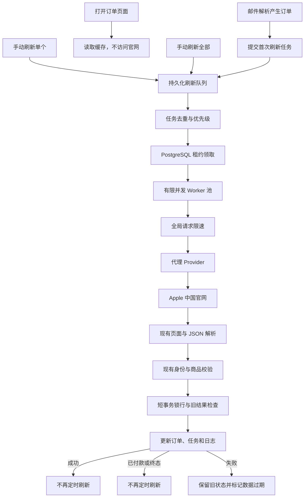

# 订单状态刷新与爬虫重构方案

> 状态：核心队列、交互、解析修复和代理安全切换已完成开发实现；兼容门面拆分、真实样本扩展和生产验收待完成
>
> 最近核对：2026-09-08
>
> 适用范围：邮件入库后的 Apple 官网订单状态刷新、人工刷新、调度、代理、任务状态和前端反馈
>
> 基线：`main@79e83e0` 与当前工作树
>
> 验证范围：Jest、隔离 PostgreSQL Migration/并发负载、快代理隧道／私密代理／网帆国内隧道、Apple 中国首页及用户授权的 83 条真实订单链接只读对照；未验证真实订单写库、邮箱、完整 Worker/API/前端切换流程和生产环境

本文档承接[订单爬虫与代理策略](../design/订单爬虫.md)的实施改造。数据库队列、异步接口、Worker、限流、代理 Provider 和前端进度已进入当前工作树；本文仍保留未完成任务与分层验收边界，不能把本地开发证据写成真实订单或生产验收。

> 2026-09-13：周期刷新已取消，现行策略见下文第三节；后文旧 REFRESH-05 和容量估算保留为历史实施基线，不作为当前分钟级验收要求。

## 2026-09-19 刷新失败优化研究

2026-09-20 后续实施：浏览器采集接缝、管理员任务票据、逐请求全局限流许可、扩展采集与系统回传已在本地接通，默认开关关闭。定向后端 114 项、前端 4 项、独立 PostgreSQL 3 项通过；随后常规后端 75 套／812 项通过、230 项按环境门控跳过。扩展已安装并完成首次实机采集：46 请求后超时，未取得有效详情；生产部署和真实更新仍待完成。当前 Chrome 后续导航出现 Page Not Found，不能再用此前两次成功代表当前可用性。0.1.1 已实机复测：第二次为无详情加载页，第三次为主文档 541；指定单三次预算已用完。下一步需当前可打开的另一笔订单授权对照；证据见[浏览器辅助刷新本地接入验收](../archive/2026-09/2026-09-20-浏览器辅助刷新本地接入验收.md)，前阶段见[接缝与复测记录](../archive/2026-09/2026-09-20-浏览器取数接缝与后续复测记录.md)。

后续实证（2026-09-20 01:44）：用户授权操控当前 Chrome 后，指定订单通过原始链接两次新导航均成功取得可见详情并导出结构化字段。此为现有用户浏览器路径成功，生产代理／全新会话仍未通过，不将单例扩展为后台稳定性结论；详见[成功记录](../archive/2026-09/2026-09-20-当前Chrome订单链接取数成功记录.md)。

真实对照补充（2026-09-20 01:35）：指定单的网帆／亦优独立浏览器均在详情请求收到 541；本机新会话预算内未取得详情，既有用户会话显示有效订单。已完成有界实验但未通过候选方案准入，暂不实现生产浏览器兜底，下一步需分离网络与会话差异。详见[实测记录](../archive/2026-09/2026-09-20-官网订单浏览器对照验证记录.md)。

最新交付（2026-09-20）：第一阶段后台可靠性代码已由应急 Worker 发布带入，本次订单反馈前端 `20260920-refresh-feedback` 已发布并完成生产页面只读验收；代理池耗尽暂停仍在，真实成功率与稳定性仍未通过。详见[发布记录](../archive/2026-09/2026-09-20-订单刷新反馈优化发布记录.md)。下文“本地／未发布”保留研究当时边界。

本节状态：用户已批准，第一阶段分类、会话健康、抓取总预算及页面反馈已本地实现；第二阶段真实取数实验尚未执行。下表保留实施前诊断基线，当前行为见[爬虫说明](../design/订单爬虫.md)，本轮验证见[开发进度](../development/开发进度.md)。基线为 `main@9701b08` 与已有未提交工作树。证据来自用户截图、当前代码、9 月 18 日排查记录及本地纯错误分类复现；本轮未查询生产数据库、请求真实订单或消耗代理额度，不能据截图推算全站失败率。下文的参数和实验预算均为建议值。

### 问题判断与代码证据

| 现象或缺口 | 已核实的事实 | 仍不能确定的部分 |
| --- | --- | --- |
| 官网仍在加载或校验 | `fetchWithRetry` 收到 guestOrderSpinner 且无 orderDetail 时报告 PARSE；HTTP 客户端不执行浏览器脚本 | 每条截图记录对应的响应、出口及失败时间未重新读取 |
| 30 秒超时 | HTTP 请求使用 `config.crawler.timeout`，默认 30 秒；默认三次请求均超时再加两段等待，约需 93 秒，另有排队／限流耗时 | 不能区分代理连接、目标响应慢或传输停滞，也不能把 93 秒当作任务硬上限 |
| aborted | 裸错误文字不足以定位；有 ERR_BAD_RESPONSE 时当前分类器识别为 RESPONSE_STREAM | 不能从截图断言用户取消了请求或某个节点断线 |
| HTTP 631 | 当前分类为 HTTP_631，没有专属处理；本轮未找到网帆公开技术文档对该码的可靠定义 | 返回方与含义待响应白名单元数据、供应商说明核实，不能直接认定为 Apple 封禁 |
| 失败会话继续复用 | 网帆 Provider 初始化固定 sid 池并轮询；recordProxyFailure、recordProxySuccess、markProxyAsBad 均无健康处理 | 更换 sid 不保证得到不同出口，也未证明会话复用就是这次失败的根因 |
| 错误分类丢失 | 重试包装只保存 refreshErrorCode，未保留原 error.code；Worker 重新分类时不读取 refreshErrorCode | 本地合成复现 PROXY_TRANSPORT／RESPONSE_STREAM 包装后均变为 UNKNOWN；未统计生产受影响量 |
| 页面旧失败文字残留 | Orders.jsx 优先使用本地 rowRefresh，列表重新加载后未按最新任务协调终态；9 月 18 日记录过成功同步后旧提示仍在 | 不能把截图全部红字认定为历史残留 |

相关抓取、错误分类、任务执行和代理会话代码已于 2026-09-22 退役；当前订单页面见[Orders.jsx](../../frontend/src/pages/Orders.jsx)。历史实测见[9 月 18 日排查记录](../archive/2026-09/2026-09-18-订单加载页误报身份冲突排查与修复.md)。

### 第一阶段：分类、会话与交互修正

1. **统一结构化错误。** 将加载／校验未完成、未知页面结构、网络超时、响应中断、主动取消、HTTP 631、541／429、身份冲突分开；任务层保留可信内部错误码，HTTP 200 不等于详情成功。记录实际尝试次数；当前最多三次是首次加两次重试，文案应改为“已尝试 3 次”，提前终止时不能仍显示 3 次。
2. **补全会话健康管理。** 有界槽位增加租用／释放、匿名槽位标识、最近成功、连续失败和冷却状态；同一详情获取流程固定代理会话，跨订单隔离 Cookie。网络失败按阈值冷却槽位，541 按现行切换出口规则处理；通过供应商正式能力和套餐约束换会话，不能无限扩张 sid。加载页单独计数，不能等同于线路死亡，也不能永久封禁隧道入口。进程内限制不能冒充多 Worker 全局并发保障。
3. **按原因执行有限重试。** 保留每订单最多三次尝试、PostgreSQL 全局限流初始 5 RPS／上限 10 RPS、少量抖动。网络失败可以更换健康槽位重试；加载页不继续把重复下载同一类 HTML 当作完整加载方案；407 继续停止并提示配置问题，631 先归因。不同故障分别记录退避和实际收益。较长冷却可通过任务 scheduledAt 延后并释放执行槽，需保存跨领取的累计尝试预算，不能每次重新从三次开始；这属于待确认实现，不恢复周期自动刷新。
4. **建立任务总时限与阶段耗时。** 分别记录排队、限流等待、连接、首字节、正文接收、解析与全任务耗时；对重定向也计入请求预算。请求 timeout 之外设置可取消的任务总时限，取消原因单独保存。具体超时值由成功样本耗时分布决定，先不统一拉长 30 秒，也不预设缩短一定有效。Axios 支持 AbortController，见[官方说明](https://github.com/axios/axios#cancellation)。
5. **页面准确展示当前结果。** 操作区显示简短中文状态，完整错误、失败时间、实际尝试数放详情；并列展示最后成功更新时间和“本次未更新，仍为上次数据”。按任务 ID／完成时间协调本地与服务端状态，后续成功清除旧错误，旧轮询不能覆盖新任务。临时失败用明确文字和辅助色，真正身份冲突保留醒目提示；权限过滤及敏感数据保护保持。可增加“重试本批失败项”，服务端重新校验每笔权限并去重。

第一阶段可以改善可诊断性、资源使用和显示准确性；能否提升真实详情成功率需要下述实验，不能直接作出成功率承诺。

### 第二阶段：受控验证详情获取方式

先只读分析已有任务／日志，将首次成功率、三次内成功率、加载页率、541／631、超时／中断、P50／P95 耗时、队列等待及每成功订单的请求数分开。按时段、代理 Provider、匿名槽位和失败阶段比较；新加指标从上线后开始积累，不从没有记录的历史日志反推。

建议首轮挑选 10 条用户授权订单，兼顾加载页与正常详情，交错执行两组对照以减少时间偏差：

- A 组：当前 HTTP 获取方式作为基线。
- B 组：相同 Provider 下，保留单次会话重定向与 Cookie 的 HTTP 方式；Cookie 仅内存、订单隔离、不跨单共享。每条／每组最多三次尝试，两组合计最多 60 次顶层尝试；重定向也纳入全局限流和额外网络预算，建议总计不超过 180 次网络请求，达到预算即停止。请求额和套餐占用须在执行前核实。

只有仍存在加载页、且前两组不能说明问题时，才追加最多 3 条失败样本的浏览器原型：每条一次原生加载、并发 1、每条最多 90 秒／100 次网络请求。保留正常校验请求，禁止订单修改、取消和支付动作；预算耗尽或访问拒绝时记录失败，不增加绕过校验逻辑。每个订单独立 BrowserContext，并固定当次代理；Playwright 官方支持[隔离 Cookie 和存储](https://playwright.dev/docs/browser-contexts)及[按上下文设置代理](https://playwright.dev/docs/network)。这些能力只证明隔离方案可实现，不证明 Apple 会返回详情。

9 月 18 日完整 Chromium 对照已出现校验请求 200、fetchOrder 541，因此浏览器兜底尚未得到真实验证；不据此直接建设浏览器集群。若原型在多个时段反复取得此前失败样本的完整详情，再考虑独立低并发浏览器服务：只在明确加载页时进入，复用原解析器、身份与商品校验、全局预算及落库门禁。浏览器尝试占用同一订单预算，不能在三次 HTTP 失败后再叠加三次浏览器重试。

若同一 Provider 的 HTTP 与正常浏览器均不稳定，再对已有可用线路做同订单集、交错时段的受控比较，按有效详情率、耗时与单次成功成本决策，不凭首页 HTTP 200 或旧试用结果采购／切换线路。

### 验收与实施顺序

| 阶段 | 验收条件 |
| --- | --- |
| 分类及页面修正 | 合成测试覆盖错误包装后码值不变、实际尝试次数、成功后清除旧提示、并行新旧任务不串状态；失败保留业务字段和最后成功时间 |
| 会话与任务治理 | 槽位隔离／释放／恢复可测，单槽租用不冲突，跨领取不突破三次预算；限制与重试无放大，Worker 重启后任务不重复落库 |
| 取数实验 | 每组报告样本量、首次／最终成功数、失败分布、请求成本和耗时；每个成功样本核对身份、全部商品数量、状态、付款、金额与门店；小样本结果不称为稳定性验收 |
| 候选方案准入 | 在至少三个分离时段复验实际加载页恢复；相对基线提高有效详情获取且未恶化请求预算与尾延迟；真实业务值全部一致。目标成功率由基线和业务要求确认，不预先承诺 95%／99% |

实施状态：第一阶段确定性缺陷已修正并完成本地测试；仍需授权小样本真实取数实验，再决定浏览器服务或线路调整。本轮未引入跨领取延迟重试，后续增加前必须持久化累计网络预算；没有声称现有租约恢复具备跨重启的网络次数累计。TCP／首字节细分采样、本批失败项一键重试仍为后续增强。未改生产配置、部署、提交或推送。

## 一、已确认需求

1. 支持自动刷新和手动刷新；手动刷新包括刷新单个订单和刷新全部订单。
2. 邮件解析出订单号和订单链接后，继续根据订单链接访问 Apple 中国官网；身份校验保持严格；解析、官网字段权威和冲突规则按[生命周期方案](真实订单生命周期与官网数据映射优化方案.md)的最新批准决策执行。
3. 2026-09-13 已批准改为首次入库刷新后仅手动刷新。付款窗口只有 30 分钟，同一时间可能存在上百条待付款订单。
4. 已付款订单仅由用户手动刷新；打开页面不自动请求官网（2026-09-09 最新决定）。
5. 允许完整重构爬虫业务模块，但不能把待实施方案写成已实现能力。

## 二、目标与边界

### 2.1 目标

- 保留新订单首次官网刷新，之后仅用户手动提交；不再生成分钟级周期任务。
- 使用持久化任务和租约，保证 API 或 Worker 重启后任务不丢失，多 Worker 不重复处理同一订单。
- 统一自动、手动单个和手动全部入口；page_open 仅保留空结果兼容入口。
- 在上百个待付款订单下控制并发、代理频率和重试放大，避免单条失败阻塞整批。
- 前端明确展示待付款订单、数据新鲜度、刷新进度和失败原因。
- 按最新官网数据权威规则解析和合并，并建立脱敏结构 Fixture 回归保护。

### 2.2 本方案不包含

- 改变邮件模板识别和订单链接提取规则。
- 本方案本身不另行定义解析口径；相关变化由已批准的生命周期方案承接。
- 把 Apple 官网支付状态用于推导内部付款人结算状态。
- 未经单独授权购买代理、执行生产 Migration、部署、重启或访问真实订单。

## 三、刷新策略

| 订单状态                   | 自动定时刷新 | 打开页面 | 手动单个 | 手动全部 |
| -------------------------- | ------------ | -------- | -------- | -------- |
| 新建、尚未完成首次官网同步 | 入库首次一次     | 不触发   | 支持     | 支持     |
| 支付状态未知               | 首次后不定时刷新     | 不触发   | 支持     | 支持     |
| 未付款                     | 不定时刷新     | 不触发   | 支持     | 支持     |
| 已付款                     | 不定时刷新   | 不触发   | 支持     | 支持     |
| 已完成、已取消及其他终态   | 不定时刷新   | 不触发   | 支持     | 支持     |
| 身份校验异常               | 暂停自动刷新 | 可提示   | 受控执行 | 受控执行 |

实施默认口径如下：

- 邮件成功创建订单后立即提交首次刷新任务。
- 2026-09-09 收紧历史空支付状态资格：未知支付不再无限等同未付款，仅待核实阶段且付款窗口内允许自动核实；付款后阶段即使支付字段为空也停止。时间优先级与队列执行复核见[爬虫说明](../design/订单爬虫.md#同步流程)。不批量回填历史业务状态。
- 2026-09-13 取消后续周期刷新：首次（initial）资格沿用既有校验；成功或失败后均由人工刷新，历史 auto/page_open 任务执行前跳过。
- 识别为已付款后立即取消后续定时计划，仅保留手动刷新能力。
- 打开订单列表与详情只读取缓存；不会自动访问官网。
- 手动“刷新全部”默认包含所有具有合法 Apple 订单链接的订单，不按付款或终态排除。
- 同一订单已有待执行或执行中任务时，新的手动触发与现有任务合并，不重复访问 Apple。

## 四、目标架构


```mermaid
flowchart TD
    A[邮件解析产生订单] --> B[提交首次刷新任务]
    D[持久化刷新队列]
    E[打开订单页面] --> Cache[读取缓存，不访问官网]
    F[手动刷新单个] --> D
    G[手动刷新全部] --> D
    B --> D

    D --> H[任务去重与优先级]
    H --> I[PostgreSQL 租约领取]
    I --> J[有限并发 Worker 池]
    J --> K[全局请求限速]
    K --> L[代理 Provider]
    L --> M[Apple 中国官网]

    M --> N[现有页面与 JSON 解析]
    N --> O[现有身份与商品校验]
    O --> P[短事务锁行与旧结果检查]
    P --> Q[更新订单、任务和日志]

    Q -->|成功| R[不再定时刷新]
    Q -->|已付款或终态| S[不再定时刷新]
    Q -->|失败| T[保留旧状态并标记数据过期]
```

核心原则是触发与执行解耦：API 和页面只提交任务，独立 Worker 负责限速、代理访问、解析、校验和写入。

## 五、任务模型

采用 PostgreSQL 持久化队列，当前规模不新增 Redis。正式字段和索引须在开发前先写入[数据库架构](../database/数据库架构.md)，再通过 Migration 实现。

### 5.1 `order_refresh_schedules`

每个订单一条调度状态，避免调度字段改变订单业务行的 `updatedAt`。

| 字段                   | 用途                                   |
| ---------------------- | -------------------------------------- |
| `order_id`             | 订单主键，一对一                       |
| `next_auto_refresh_at` | 下一次未付款自动刷新时间；已付款时为空 |
| `last_attempt_at`      | 最近一次实际发起请求时间               |
| `last_success_at`      | 最近一次成功写入时间                   |
| `last_failure_at`      | 最近一次最终失败时间                   |
| `consecutive_failures` | 连续失败次数                           |
| `freshness_status`     | `fresh/stale/refreshing/failed`        |
| `updated_at`           | 调度状态更新时间                       |

### 5.2 `order_refresh_jobs`

每次实际执行对应一条任务记录。

| 字段                 | 用途                                       |
| -------------------- | ------------------------------------------ |
| `id`                 | 任务 ID                                    |
| `order_id`           | 目标订单                                   |
| `trigger`            | `auto/page_open/manual_single/manual_all`  |
| `status`             | `pending/running/succeeded/failed/skipped` |
| `priority`           | 调度优先级                                 |
| `scheduled_at`       | 最早执行时间                               |
| `lease_owner`        | 领取任务的 Worker                          |
| `lease_expires_at`   | 租约到期时间                               |
| `attempt_count`      | 已执行请求次数                             |
| `last_error_code`    | 结构化错误码                               |
| `last_error_message` | 脱敏错误摘要                               |
| `batch_id`           | 手动全部刷新批次，可为空                   |
| `requested_by`       | 人工触发用户，可为空                       |
| `started_at`         | 开始时间                                   |
| `finished_at`        | 结束时间                                   |

数据库应保证同一订单最多只有一个 `pending/running` 任务。重复请求不创建第二次官网访问，而是关联现有任务或提升优先级。

### 5.3 `order_refresh_batches`

记录手动刷新全部的总数、待执行、执行中、成功、失败、跳过和完成时间。运行中再次点击“刷新全部”时返回现有批次，不重复创建全量任务。

### 5.4 `crawl_logs`

继续承担抓取执行审计和排障。任务状态与抓取日志职责分离：任务表回答“是否排队和完成”，日志表回答“请求、解析或写入为什么成功或失败”。原始响应和错误信息继续遵守敏感数据最小化与脱敏要求。

## 六、调度、优先级与去重

Scheduler 每 5 秒领取到期任务，但不会每 5 秒抓取所有订单。任务使用数据库事务和 `FOR UPDATE SKIP LOCKED` 领取，并写入带期限的 Worker 租约。

优先级由高到低：

1. 手动刷新单个订单。
2. 入库首次刷新任务 initial。
3. 历史 page_open 任务仅兼容读取，执行时跳过，不更新最后成功时间。
4. 手动刷新全部产生的批量任务。

调度规则：

- 周期自动调度取消；首次刷新与手动刷新共用现有有限并发和全局限流。
- Worker 异常退出后，其他 Worker 可在租约过期后重新领取。
- 页面重复加载、用户重复点击、自动任务与人工任务同时到达时，按 `order_id` 合并。
- 手动刷新单个订单可提升现有待执行任务优先级；已有请求正在执行时直接观察该任务结果。
- 单次任务保留既有最多三次请求尝试；任务最终失败后由人工重试，不安排下一分钟刷新。

## 七、模块拆分

```text
src/services/crawler/
├── appleOrderFetcher.js
├── appleOrderParser.js
├── orderValidator.js
├── orderPersistService.js
├── refreshPolicy.js
├── refreshJobService.js
├── refreshJobRepository.js
├── crawlerRateLimiter.js
└── proxy/
    ├── proxyProvider.js
    ├── kdlTunnelProvider.js
    └── kdlPrivateProvider.js
```

| 模块                   | 单一职责                                       |
| ---------------------- | ---------------------------------------------- |
| `appleOrderFetcher`    | 通过代理访问 Apple、处理超时并返回页面         |
| `appleOrderParser`     | 沿用现有 Cheerio、script JSON 和中文关键词解析 |
| `orderValidator`       | URL、官网返回身份、商品和数量校验              |
| `orderPersistService`  | 短事务、订单锁、旧结果拒绝、订单及日志写入     |
| `refreshPolicy`        | 判断自动刷新资格和下一次时间                   |
| `refreshJobService`    | 创建、合并、提升优先级和结束任务               |
| `refreshJobRepository` | PostgreSQL 领取、租约和批次统计                |
| `crawlerRateLimiter`   | 全局请求速率、并发和退避                       |
| `proxyProvider`        | 隔离快代理隧道、私密代理及未来供应商差异       |

现有 `crawlerService.js` 在过渡期保留兼容门面，完成调用迁移后再删除集中实现，避免一次性切断现有 API 和测试入口。

## 八、接口草案

接口草案只在本方案中维护；开发时必须先更新[API 契约](../design/API设计.md)。

| 方法   | 路径                              | 作用                                       |
| ------ | --------------------------------- | ------------------------------------------ |
| `POST` | `/api/orders/:id/refresh`         | 手动刷新单个订单，返回 `202` 和 `jobId`    |
| `POST` | `/api/orders/refresh-all`         | 手动刷新全部，返回 `202` 和 `batchId`      |
| `POST` | `/api/orders/page-open-refresh`   | 提交当前页面可见订单，后端按策略过滤和去重 |
| `GET`  | `/api/order-refresh/jobs/:id`     | 查询单个任务状态                           |
| `GET`  | `/api/order-refresh/batches/:id`  | 查询全部刷新批次进度                       |
| `GET`  | `/api/system/auto-refresh`        | 返回持久化 Worker、队列、暂停和新鲜度状态  |
| `POST` | `/api/system/auto-refresh/resume` | 在完成权限和故障确认后恢复持久化调度       |

现有 `/api/orders/batch-refresh` 在迁移期保留兼容层，前端完成迁移后再决定废弃时间。所有人工入口继续要求 `refresh` 权限，系统控制入口仅管理员可用。

## 九、页面行为

### 9.1 订单列表

- 先展示数据库缓存，不阻塞首屏等待 Apple。
- 默认支持“仅看待付款”，待付款订单优先排序。
- 显示待付款总数、最后成功刷新时间及 `排队中/刷新中/最新/已过期/失败`。
- 打开页面只读取数据库；未付款订单由独立调度器刷新。
- 后台任务完成后局部更新对应行，不能把“任务已提交”提示成“官网已更新”。
- 超过 90 秒没有成功结果的未付款订单标记为过期，并显示失败原因摘要。

### 9.2 订单详情

- 打开订单详情不提交刷新任务。
- 已有任务时复用并展示其进度。
- 手动刷新按钮始终可用，但继续经过权限、去重、限速和审计。

### 9.3 刷新全部

- 点击前明确提示目标数量和可能耗时。
- 提交后展示批次总数、待执行、成功、失败和完成状态。
- 单个失败不终止其他订单；失败项可以进入明细并单独重试。

付款倒计时优先使用官网付款截止 Epoch，回退准确官网创建时间加 30 分钟，不使用本地创建时间猜测。

## 十、代理、并发与重试

### 10.1 容量基线

100 个未付款订单每分钟产生 100 次正常请求，平均约 1.67 次/秒；若每个订单最多尝试 3 次，理论上可能放大到每分钟 300 次。建议初始参数：

- Worker 并发数：8–10。
- 代理产品能力：至少 10 次/秒。
- 应用内部请求上限：先以 5–8 次/秒压测，根据 Apple 实际成功率调整。
- 单订单最多尝试 3 次，所有重试都经过全局限速器。
- 删除订单之间固定 5–10 秒的串行等待，改用全局限速和小幅随机抖动。

### 10.2 代理 Provider

系统支持快代理隧道 Pro、快代理私密代理和网帆国内隧道三种 Provider。三套凭据预先配置到 Worker 环境后，管理员可在管理页面请求切换；Worker 只在当前批次结束后初始化候选 Provider，并在 Apple 中国首页健康检查通过后原子切换，失败继续使用旧 Provider。切换状态只保存非敏感元数据，新增或更换凭据仍需单独更新运行配置并重建 Worker。

Apple 订单入口存在跨主机重定向，因此“每次 HTTP 请求换 IP”会破坏同一次订单抓取的出口一致性。快代理隧道 Provider 使用固定 Host、端口和鉴权，每次抓取尝试生成独立 `sid`，通过 `period-0.5` 在 30 秒内固定出口；网帆隧道 Provider 为每次尝试生成 `acc/cty/reg/sid` 账密用户名，由相同 `sid` 保持单次尝试的会话出口。两种隧道模式均在发生重试时生成新 `sid` 请求切换出口，并关闭连接复用。快代理默认选择兼容性优先的企业池 `type-std` 和质量优先 `pool-q10`；私密代理继续使用提取 API 和坏 IP 冷却池。

动态隧道请求需关闭连接复用并验证“单次尝试出口固定、重试出口切换”。保持 Axios 原生代理传输并使用 gzip；真实订单对照实验未证明自定义 `HttpsProxyAgent` 有收益，不引入并行传输实现。最终产品、带宽和并发规格以真实 Apple 订单试用结果为准，不能用供应商对其他网站的可用率代替业务验收。

### 10.3 错误分类

| 错误类型                 | 处理方式                                                       |
| ------------------------ | -------------------------------------------------------------- |
| Apple `541/429`          | 目标风控；更换出口、退避重试并统计比例                         |
| 快代理 `441`             | 代理频率超限；降低速率，不修改订单状态                         |
| 代理 `407`               | 鉴权或配置故障；停止领取新任务并告警                           |
| 快代理 `517`             | 代理建链失败；更换会话和入口后受控重试                         |
| 连接超时、隧道错误       | 网络/代理错误；更换出口后受控重试                              |
| 页面 JSON 缺失或结构变化 | 解析错误；不把正常代理永久废弃                                 |
| 订单身份不匹配           | 禁止写入并告警，不增加普通业务失败计数                         |
| 商品校验异常             | 采用官网有效值，保留来源差异并显示行首冲突；身份异常仍拒绝覆盖 |

同一订单第一次失败可更换出口重试；后续重试增加短随机退避。单次 541 不直接暂停全局 Worker，只有连续订单均在三次尝试中全部收到 541 时才累计断路阈值；任一订单后续重试成功会清零计数。触发全局断路后系统必须把未付款数据标为过期并告警，不能继续显示为最新。

## 十一、数据处理保持项

以下当前正确行为在重构中必须保留：

- 只接受与本地订单号、Apple ID 完全一致的 `www.apple.com.cn` 订单链接。
- 官网返回订单号缺失或不匹配时禁止更新。
- 使用 Cheerio 从 script 中提取订单 JSON，不默认引入浏览器执行。
- 订单状态以订单项 JSON 的 `currentStatus` 为第一权威来源，清理后的可见订单文本只作兼容回退。
- 已观测的 `PICKED_UP` 映射为 `picked_up`；`PAYMENT_EXPIRED_STORED_ORDER` 映射为 `payment_expired/unpaid`，保留商品原始状态。
- 保留付款、取货、商品和门店解析；官网没有总计标签和金额时记录为未提供，不伪造金额或解析错误。
- 官网有效商品数量为权威，含取消后的 0；导入值保留在来源快照，差异可查看。
- 网络请求在数据库事务外执行。
- 写入时锁定订单，并拒绝爬取期间产生的旧结果。
- 失败保留旧业务状态，成功后才更新 `lastCrawledAt` 和官网字段。

## 十二、实施任务

| 编号       | 优先级 | 任务                                  | 依赖                 | 主要验收                                           |
| ---------- | ------ | ------------------------------------- | -------------------- | -------------------------------------------------- |
| REFRESH-01 | P1     | 更新数据库、API、爬虫和测试权威契约   | 本方案               | 规划与当前能力边界清楚                             |
| REFRESH-02 | P1     | 新增调度、任务和批次 Migration        | REFRESH-01           | `up/down/up` 与索引约束通过                        |
| REFRESH-03 | P1     | 拆分 Fetch、Parse、Validate、Persist  | REFRESH-01           | 现有解析和校验回归全部通过                         |
| REFRESH-04 | P1     | 实现持久化任务、去重和 Worker 租约    | REFRESH-02           | 重启不丢任务，多 Worker 不重复执行                 |
| REFRESH-05 | P1     | 实现未付款 60 秒策略和已付款停止策略  | REFRESH-04           | 100 条未付款订单满足调度时效                       |
| REFRESH-06 | P1     | 改造手动单个、手动全部和页面刷新 API  | REFRESH-04           | 返回真实任务/批次状态，不同步阻塞                  |
| REFRESH-07 | P1     | 实现限速、重试、错误分类和断路保护    | REFRESH-03、04       | 541、441、407、超时和解析错误可区分                |
| REFRESH-08 | P1     | 接入快代理隧道 Provider               | REFRESH-07           | 固定隧道鉴权、换 IP 和错误码测试通过               |
| REFRESH-09 | P1     | 改造订单列表、详情和刷新全部进度      | REFRESH-05、06       | 待付款、新鲜度和刷新状态清晰                       |
| REFRESH-10 | P1     | 补齐调度、并发、权限和相邻回归测试    | REFRESH-03 至 09     | 单元、PostgreSQL 集成、API 与前端测试通过          |
| REFRESH-11 | P1     | 执行 100–300 单负载测试               | REFRESH-10           | 无重复、无遗漏、未付款调度不被批量刷新阻塞         |
| REFRESH-12 | P1     | 真实 Apple 与代理试用、发布和观察     | REFRESH-11、单独授权 | 业务成功率和一分钟时效达标，具备回滚与观察记录     |
| REFRESH-13 | P1     | 安全切换代理 Provider 并执行 A/B 测试 | REFRESH-08、单独授权 | 批次边界验证后切换、失败回滚；同批订单交错对照     |
| REFRESH-14 | P1     | 接入网帆隧道并统一三方运行时切换      | REFRESH-13           | 三方配置校验、候选健康检查、切换回退和错误语义通过 |

### 12.1 2026-09-07 实施状态

| 编号       | 当前状态            | 本轮证据或剩余项                                                                                                                                                                                                                                           |
| ---------- | ------------------- | ---------------------------------------------------------------------------------------------------------------------------------------------------------------------------------------------------------------------------------------------------------- |
| REFRESH-01 | 已完成              | 数据库架构、API 契约、技术决策、爬虫说明和编码规则已同步                                                                                                                                                                                                   |
| REFRESH-02 | 开发自测通过        | 隔离库全量 Migration 及 `up → down → up` 通过，四张表、检查约束和部分唯一索引存在                                                                                                                                                                          |
| REFRESH-03 | 部分完成            | Policy、Job Repository、Rate Limiter 与 Proxy 已拆分；Parse、Validate、Persist 仍在兼容门面，HTML Fixture 待补                                                                                                                                             |
| REFRESH-04 | 开发自测通过        | 同订单任务合并、优先级提升、`SKIP LOCKED` 双 Worker 领取和过期租约恢复通过                                                                                                                                                                                 |
| REFRESH-05 | 规则与调度实现完成  | 60 秒资格策略和已付款停止策略单测通过；真实 Apple 连续时效未验收                                                                                                                                                                                           |
| REFRESH-06 | 已完成              | 单笔、指定批量、刷新全部、页面触发和任务/批次查询均改为异步状态接口                                                                                                                                                                                        |
| REFRESH-07 | 已完成              | 全局持久化限流、最多三次重试、541/429/441/407/517 分类和 407 持久化暂停已实现；只有连续订单均在三次尝试中全部收到 541 才累计全局断路阈值，重试成功不会误停 Worker                                                                                          |
| REFRESH-08 | 部分通过            | 隧道主备入口、凭据脱敏、关闭连接复用、gzip、30 秒固定出口和每次重试换 `sid` 已实现；`type-std + pool-q10` 将 83 条真实链接三次内成功数从 49 提高到 71，但仍有 12 条失败，不满足稳定性验收                                                                  |
| REFRESH-09 | 开发实现完成        | 列表、详情、刷新全部进度、新鲜度和待付款筛选已接入；浏览器人工验收待执行                                                                                                                                                                                   |
| REFRESH-10 | 部分完成            | Jest、权限回归和 PostgreSQL 集成已执行；真实 API 会话与前端浏览器测试待执行                                                                                                                                                                                |
| REFRESH-11 | 调度层通过          | 隔离库 300 单、10 Worker 领取 300 条且无重复，最大开始延迟 226ms；未产生 Apple 请求                                                                                                                                                                        |
| REFRESH-12 | 部分执行、未通过    | 最终解析版 83 条同订单集 A/B 中，隧道成功 `75/83`、私密成功 `55/83`、身份不匹配 0；真实结构样本已用于修复 `currentStatus`、订单项键、隐藏退款文案和金额缺失语义。两侧均未达到稳定性目标；真实退货样本、写库、Worker、生产 Migration、部署和观察未执行      |
| REFRESH-13 | 开发实现与 A/B 完成 | PostgreSQL 保存非敏感切换意图和 Worker 确认结果；候选 Provider 初始化及 Apple 首页健康检查成功后才在批次边界原子切换，失败保留旧 Provider。83 条同订单集 A/B：隧道 `75/83`、私密 `55/83`，私密试用线路未通过稳定性评估；完整 Worker/API/前端人工验收未执行 |

### 12.2 2026-09-08 三方代理切换实现

| 编号       | 当前状态                                   | 本轮证据或剩余项                                                                                                                                                                                                                                                                                                                                                                                                                                                                                                                                                                                                  |
| ---------- | ------------------------------------------ | ----------------------------------------------------------------------------------------------------------------------------------------------------------------------------------------------------------------------------------------------------------------------------------------------------------------------------------------------------------------------------------------------------------------------------------------------------------------------------------------------------------------------------------------------------------------------------------------------------------------- |
| REFRESH-14 | 开发自测通过；网帆真实链路未通过稳定性验收 | 新增 `fanproxy_tunnel` Provider、环境配置、数据库约束、管理员三选一入口和 Provider 专属错误分类；候选初始化、健康检查、批次边界切换与失败保留旧线路沿用统一切换链路。网帆真实套餐诊断后增加 `basic/sticky_pool` 会话模式和有界会话槽，防止无限创建 `sid`；只读诊断脚本支持显式单 Provider。用户授权的同一 83 条订单以 1 RPS、最多 3 次执行，网帆 5 槽 `sticky_pool` 成功 `68/83`（81.93%），低于上一日快代理隧道 Pro `75/83`（90.36%）；最终失败 15，主要尝试错误为 541 50、网帆未公开的 424 20 和 631 8。凭据仅写入本地忽略的 `.env`，调度保持暂停、活动 Provider 保持 `kdl_private`；未写订单、未执行生产操作。 |

### 12.3 2026-09-08 亦优 HTTP Provider 接入

| 编号       | 当前状态                                   | 本轮证据或剩余项                                                                                                                                                                                                                                                                                                                                                                                                                                                                                                                                                           |
| ---------- | ------------------------------------------ | -------------------------------------------------------------------------------------------------------------------------------------------------------------------------------------------------------------------------------------------------------------------------------------------------------------------------------------------------------------------------------------------------------------------------------------------------------------------------------------------------------------------------------------------------------------------------- |
| REFRESH-15 | 开发自测通过；真实链路局部通过，非生产验收 | 新增 `yiyou_http` Provider、官方 HTTPS 提取域名校验、`IP:端口 用户名 密码` 解析、240 秒安全 TTL、坏 IP 隔离、环境配置、数据库四值约束和管理员四选一入口。管理页候选健康检查与原子切换成功。同一 83 条真实订单以 1 RPS、最多 3 次执行，成功 `82/83`（98.80%），94 次尝试中仅有 541 6 次和 `ECONNRESET` 6 次，唯一最终失败为 541。本轮成功率高于快代理隧道 Pro 与网帆跨时段基线，因此亦优已调整为无环境显式值时的代码默认、配置示例默认和管理页首位；首选不改变候选健康检查、失败保留旧 Provider 和无自动跨供应商降级的边界。平均约 17.5 秒/单，尚需更长时间与生产规格观察。 |

## 十三、验收标准

### 13.1 业务验收

- 新订单在邮件入库后立即进入首次刷新队列。
- 首次刷新结束后等待超过 60 秒不再产生自动任务，人工刷新仍可提交和完成。
- 已付款订单在后续观察周期内不产生定时任务。
- 打开列表和详情均不触发官网刷新，旧 page_open 兼容入口不创建任务。
- 手动单个和手动全部均可执行并展示真实进度。
- 付款状态变化后，订单及时移出待付款集合。
- 刷新失败时保留旧状态，并明确显示最后成功时间和已过期状态。

### 13.2 一致性与可靠性验收

- 自动、页面和人工触发同时发生时，同一订单只访问 Apple 一次。
- API、Worker 重启后，待执行任务、批次和暂停原因不丢失。
- 两个 Worker 并行运行时不重复领取或覆盖同一订单。
- 单条失败不阻塞其他订单，刷新全部可以部分成功。
- 并发爬取期间发生人工修改时，旧结果不会覆盖新数据。

### 13.3 错误与安全验收

- 541、429、441、407、代理传输、解析、身份和数据库错误分别记录。
- 日志不包含 Apple 密码、完整订单链接、代理密码或不必要的个人信息。
- 权限不足不能提交单个、全部或恢复调度操作。
- 代理、Apple 或数据库异常时不能伪造刷新成功。

### 13.4 测试边界

- 单测和模拟服务证明内部规则，不证明真实 Apple 或代理兼容性。
- PostgreSQL 集成测试证明租约、事务、索引和并发行为，不证明生产运行。
- 真实订单、代理购买、生产 Migration、部署、重启和业务观察分别需要明确授权和验收记录。

## 十四、开发开始前检查

1. 先更新数据库架构和 API 契约，再编写模型、Migration、Controller 和前端调用。
2. 冻结一组脱敏 HTML/JSON Fixture，保证原解析规则在重构前后结果一致。
3. 明确快代理测试账号、隧道规格、测试订单和允许的请求窗口。
4. 定义一分钟时效、数据过期、最终成功率和 541 比例的业务验收阈值。
5. 为 Migration、调度切换、Worker 扩容和代理切换准备回滚方案。
6. 每个实施批次更新[开发进度](../development/开发进度.md)，区分开发自测、集成测试、真实官网验收和生产验收。

## 2026-09-09 持续补位增量

已按用户授权修复整批等待：领取循环与在途执行分开，按空闲并发名额补位，增加续租、切换排空与关闭等待。REFRESH-10 增补慢任务期间晚入队任务、满载与补位、暂停和退出的回归，单元及隔离数据库验证通过；发布与生产证据见[修复记录](../archive/2026-09/2026-09-09-刷新队列持续补位修复发布记录.md)。

## 10 并发本机浏览器执行器（2026-09-21）

用户已批准按 10 并发设计及编码。采用独立上下文、独占代理、持久化批次和既有票据回传链路，任务并发与全局 RPS 分开。本地实现与合成浏览器验收通过；2026-09-21 API 已发布并启用管理员入口，原全局暂停保持。真实双并发已于 02:47–02:48 执行，339／340 各三次均未取得详情，观测到 HTTP 541，未回写；原暂停与 Worker 已恢复。5／10 并发未执行，新代理复测仍遇 HTTP 541；查询参数详情动作漏识别与代理池轮转已修复，新增仅订单状态／商品的采集和回写边界；190项定向与5项隔离数据库通过，真实343–346仍遇541，业务验收未完成。见[后续修复记录](../archive/2026-09/2026-09-21-浏览器响应识别修复与最小字段同步.md)。见[生产验收记录](../archive/2026-09/2026-09-21-本机并发刷新生产验收记录.md)。具体协议见[爬虫说明](../design/订单爬虫.md#本机隔离浏览器批量刷新2026-09-21本地实现真实官网待验收)。
